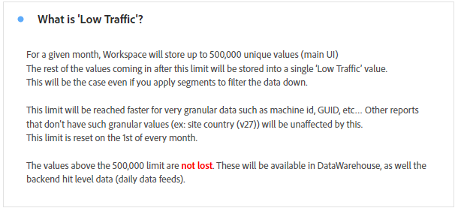

# Erstellen von operativen Dashboards in Analysis Workspace

_Erfahren Sie, wie operative Dashboards in Adobe Analytics Workspace Kommunikation und Effizienz revolutionieren. Erfahren Sie, wie Sie Dashboards für FAQs, Nachrichten und Ankündigungen sowie Fehler und Funktionen erstellen, um optimierte Informationen, ein besseres Benutzererlebnis und eine verbesserte Interaktion zu erzielen._

Wie viele Admins leite ich einen internen Info-Hub (Confluence oder ähnlich) für Adobe Analytics. Im Laufe der Zeit hatte ich es satt, immer wieder die gleichen Fragen zu beantworten, und brauchte einen reibungsloseren Weg, um meine Benutzerinnen und Benutzer zu erreichen, ohne das Gefühl zu haben, dass ich sie ständig anpinge und nerve. Ich benötigte Repositorys für weniger statische Informationen.

Ich bemerkte, dass Benutzerinnen und Benutzer meine Verweise auf die Confluence-Site oft ignoriert haben, mit Gründen wie „Mein VPN ist aus“, „Ich kann es jetzt nicht lesen“ usw. Grundsätzlich bedeutet: „Ich werde dieses Dokument später lesen“, dass es nie gelesen wird und dieselbe Frage nächste Woche erneut gestellt wird.

***Dann kam der Aha-Moment:**Die Vielseitigkeit von Workspace könnte die Lösung sein. Benutzerinnen und Benutzer bevorzugen schnelle, direkte Antworten in Workspace, also bleiben wir in Workspace und vermeiden wir extra Schritte für sie.*

Ich habe losgelegt und operative Dashboards erstellt, um sie für das ganze Unternehmen freizugeben. Sie haben bisher die Benutzerinnen und Benutzer gut auf dem Laufenden gehalten, Informationen zentralisiert und Frustrationen reduziert. Dies ist ein einfacher, sich entwickelnder Prozess, der die Effizienz im Laufe der Zeit steigert.

Die Menschen haben es geschafft, viele gute Informationen ohne mich zu erhalten, Bereiche der Website zu verstehen, zu sehen, wie cool Adobe Analytics ist, und (wichtig für mich 😊) stellen Sie mir weniger Fragen und nehmen weniger Zeit.

**Ich empfehle dringend, dass Sie Dashbords für all Ihre Assets oder Hauptbereiche Ihrer Site erstellen.** Sie sollten einen Überblick über das Asset, die Site, die App bzw. den Fluss geben und grundlegende Informationen sowie schnelle Einblicke erhalten. Diese sollten für das gesamte Unternehmen freigegeben werden, sodass alle Benutzerinnen und Benutzer das Asset verstehen können, ohne an die Hand genommen werden zu müssen. Diese Dashboards beantworten für mich in der Regel 80 % der Fragen, die ich bekomme, und sparen mir wertvolle Zeit.

Nichts davon hindert Sie daran, Ihre Confluence-Website zu behalten, was weiterhin sehr nützlich ist. Ich verweise sogar oben in jedem operativen Dashboard darauf. Aber ich liebe Tastaturbefehle – sowohl für mich als auch für meine Benutzerinnen und Benutzer.

Lassen Sie mich Sie durch die drei operativen Dashboards führen, die ich für mein Unternehmen „GenDigital“ erstellt habe und die mir dabei geholfen haben, diese Ziele zu erreichen.

1. Häufig gestellte Fragen (FAQ)
1. Nachrichten und Ankündigungen
1. Protokoll zu Fehlern, Funktionen und Hauptversionen

## 1 – FAQ-Dashboard

Müde, ständig dieselben Antworten geben zu müssen? Stopp! Sparen Sie Zeit, indem Sie ein FAQ-Dashboard erstellen. Benutzerinnen und Benutzer können es einsehen, bevor sie fragen, oder Sie können in Ihren Antworten schnell darauf verlinken.

Erstellen Sie einfach [Textvisualisierungen](https://experienceleague.adobe.com/docs/analytics/analyze/analysis-workspace/visualizations/text.html?lang=de), wobei die Fragen als Titel und die Antworten/Erklärungen als Inhalt formatiert sind und letztere alle eingeklappt sind, um nur die Frage anzuzeigen. Gruppieren Sie sie nach Relevanz (z. B. Seiten oder Produkte) oder verwenden Sie Panels. Halten Sie es einfach und führen Sie die gängigsten Fragen zuerst an.

Aktualisieren Sie Ihr FAQ-Dashboard, anstatt lange E-Mails zu schreiben oder alte Erklärungen nachzuschlagen. Beginnen Sie jetzt und erweitern Sie die Dashboards im Laufe der Zeit. Verwenden Sie Hyperlinks, um in Berichten auf andere Dashboards oder verwandte FAQs zu verweisen. Liefern Sie bei Bedarf einen komplexen Kontext, indem Sie von anderen Dashboards auf häufig gestellte Fragen verlinken.

Bei GenDigital konzentrieren sich unsere häufig gestellten Fragen auf die benutzerdefinierte Verwendung von Adobe Analytics, nicht auf die Grundlagen. Versenden Sie spezifische FAQ-Links per E-Mail, indem Sie mit der rechten Maustaste auf etwas klicken, „Visualisierungs-Link abrufen“ auswählen und die Vanity-URL teilen. Dadurch wird der genaue Inhalt für Benutzerinnen und Benutzer hervorgehoben. Verwenden Sie Freiformtabellen zur Illustration von Daten und fügen Sie weitere Erklärungen mit der Option „Beschreibung bearbeiten“ hinzu.

Sobald sich Ihre FAQs umfassend anfühlen, teilen Sie sie mit dem Unternehmen, damit alle darauf zugreifen und lernen können. Erweitern Sie sie nach Bedarf.

Im Folgenden finden Sie einige Screenshots dazu, wie ein FAQ-Dashboard aussehen kann:

## 2 – Dashboard für Nachrichten und Ankündigungen

Ein weiteres nützliches operatives Dashboard ist das Dashboard für Nachrichten und Ankündigungen. Ich habe dieses Dashboard erstellt, weil ich meinen Benutzerinnen und Benutzern Informationen liefern wollte, doch ich hatte das Gefühl, dass ich sie damit nur anpinge und nerve. Benötigt jeder diese Aktualisierung? Welche Benutzerinnen und Benutzer? Nur Power Users? Sollte ich einen wöchentlichen Newsletter versenden, den doch niemand liest? Wenn Sie die Aktualisierung stattdessen direkt in Workspace durchführen, können Benutzende sie sehen, sobald sie sich anmelden. Ich muss keine weitere Unternehmens-E-Mail senden, die niemand lesen möchte.

Da diese Dashboards unternehmensweit angezeigt werden, steigen die Aktualisierungen sofort an die Spitze. Hier ist die Art von Informationen, die ich in mein Dashboard für Nachrichten und Ankündigungen aufnehme:

- Veröffentlichungen und Aktualisierungen von Funktionen von unserer Seite (hauptsächlich Code-Versionen)
- Wichtige neue Funktionen von Adobe
- Arbeitszeitenplan
- Liste aller Übersichts-Dashboards und coolen Berichte zum Durchstöbern

Darin werden unsere neuen Funktionen, Tracking und wichtige Dashboards abgedeckt. Über Hyperlinks in Textberichten (oder mit Rechtsklick und dann „Beschreibung bearbeiten“) können Sie auf andere Dashboards in Adobe Analytics oder die Adobe-Seite für die Veröffentlichung von Funktionen verlinken.

So sieht mein Dashboard „Nachrichten und Ankündigungen“ aus:

## 3 – Protokoll zu Fehlern, Funktionen und Hauptversionen

Ziel dieses operativen Dashboards ist es, einen zentralen Ort zu haben, um alle Bugs und Fehler dort einzustellen. Früher habe ich das mit Excel gemacht, aber es war mühsam und das Teilen war schwierig. Warum es nicht direkt bei Workspace einstellen?

Sie können es in das Dashboard „Nachrichten und Ankündigungen“ integrieren, wenn es nicht so sehr im Vordergrund stehen soll. Wenn Fehlerberichte jedoch für Ihr Unternehmen wesentlich oder entscheidend sind, kann ein separates Dashboard sinnvoll sein.

Ich benutze eine Textvisualisierung und halte sie mit Aufzählungspunkten sehr einfach. Den Aufzählungspunkten wird das Datum des Fehlers sowie das Asset vorangestellt (z. B. „3jan23-17jan23 – Norton.com“, „Vor 14sept22 – Chat“). Ich füge dann die Details hinzu und versuche, es kurz und prägnant zu halten. Ich vermeide es anzugeben, welches Team Schuld hatte, und vermeide es auch, zu viele technische Details hinzuzufügen, für die sich Ihre Benutzerinnen und Benutzer vermutlich nicht interessieren.

Der neueste Bug befindet sich ganz oben, während ältere in jährlichen Textberichten enthalten sind (z. B. „2022 – Bekannte Bugs, Fehler und Änderungen“) – alle sind eingeklappt.

Nichts zu Ausgefallenes. Es ist wirklich einfach zu verwenden, und Sie müssen zugeben, es ist viel besser, als eine Excel-Datei auf Ihrer Festplatte zu haben oder etwas auf Confluence aktualisieren zu müssen.

Ich verweise hier auch auf Übersichts-Dashboards und coole Berichte, ähnlich wie bei anderen operativen Dashboards. Links zu FAQs und dem Dashboard „Nachrichten und Ankündigungen stehen ganz oben.

Im Folgenden sehen Sie ein Beispiel dafür, wie Ihr Protokoll aussehen kann:

Operative Dashboards in Adobe Analytics Workspace einzurichten, war ein Gamechanger für mich. So wie viele Admins leitete ich einen internen Hub und hatte oft mit doppelten Antworten zu kämpfen und damit, wie man wirkungsvoll mit Benutzenden kommuniziert. Der Bedarf an dynamischen Repositorys führte zu der Erkenntnis, dass die Vielseitigkeit von Workspace die Interaktion revolutionieren könnte. Ich hoffe, dass Sie die Leistungsfähigkeit der operativen Dashboards in Adobe Analytics Workspace für sich entdecken werden. Verbessern Sie das Benutzererlebnis, sparen Sie Zeit und genießen Sie eine besser organisierte Umgebung. Ihre Journey beginnt jetzt, und diese Dashboards sind Ihr Schlüssel zu Effizienz und Benutzerfreundlichkeit.

## Autor

Dieses Dokument wurde verfasst von:

**Christel Guidon**, Analytics Platform Manager bei Gen Digital

Adobe Analytics-Expertin
