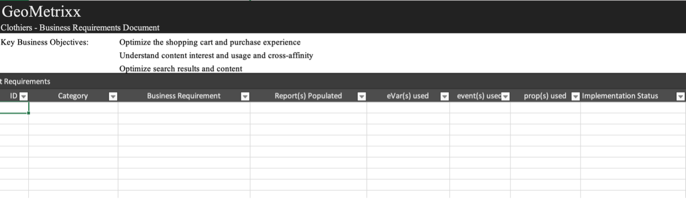
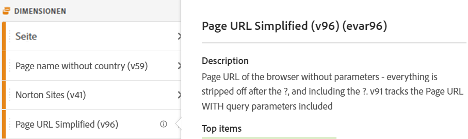
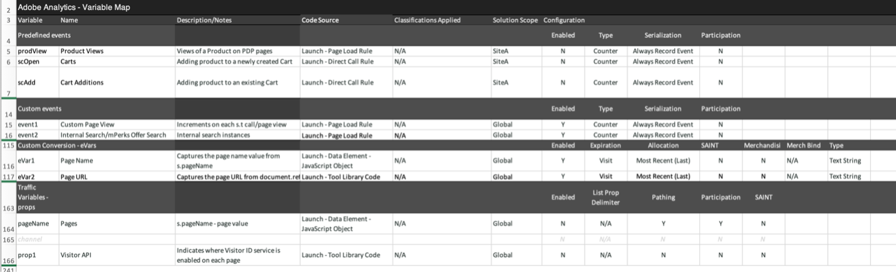
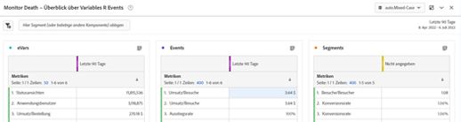

# Adobe Analytics-Implementierungs-Playbook herunterladen

Bevor Sie beginnen, [laden Sie das Playbook herunter](assets/aa-implementation-playbook.xlsx).

## Registerkarte „Geschäftsanforderungen“

**WAS:** Ein Business Requirements Doc (allgemein als BRD bezeichnet) ist eine sehr wichtige Dokumentation, an der wesentliche Stakeholder, Geschäftsbenutzer und technische Anwender zusammenarbeiten sollten. Hier können Sie alle gewünschten KPIs, Reporting-Anforderungen und jeden Datenpunkt dokumentieren, den Sie nach Abschluss der Adobe Analytics (AA)-Implementierung sehen möchten.

**WARUM:** Dies dient als Ausgangspunkt für die nachfolgende Dokumentation (SDR, technische Spezifikationen usw.) und ist eine gemeinsame Quelle der Wahrheit für einen vereinbarten Endzustand von AA. Dieses Dokument fasst die Gedanken der verschiedenen Teams innerhalb der Organisation zusammen, um eine einheitliche Richtung für den Aufbau oder die Verbesserung Ihrer Implementierung festzulegen.

**WIE:** Die Dokumentation der Geschäftsanforderungen wird in der Regel von den geschäftlichen Endbenutzern von AA durchgeführt. Es ist jedoch wichtig, Feedback von technischen Anwendern zu erhalten, da technische Herausforderungen zu beachten sind und bestimmte Datenpunkte möglicherweise mehr Aufwand erfordern als andere, was wiederum zu einer Priorisierung führen sollte.

Fragen Sie sich: „Welche Dinge wollen wir auf unserer Website nachverfolgen?“, „Welche Datenpunkte sind für mich beim Reporting wichtig?“ und vor allem: „Wie werden diese Datenpunkte in Entscheidungen einfließen?“ Es ist wichtig, dass sich jede Ihrer geschäftlichen Anforderungen auf einen Datenpunkt bezieht, der als Grundlage für geschäftliche Entscheidungen dienen kann. Es kann zum Beispiel verlockend sein, jeden Klick auf Ihrer Website zu verfolgen, aber welche Erkenntnisse gewinnen Sie letztendlich aus diesen Berichten?

Füllen Sie zunächst Spalte C im folgenden Screenshot aus (Geschäftsanforderung). Dabei sollte es sich um Fragen handeln wie „Wie viele interne Suchvorgänge werden auf unserer Website durchgeführt?“ oder „Welcher interne Kampagnenspot ist in Bezug auf die Anzahl der Impressionen am effektivsten?“ Nachdem Sie diese Informationen eingegeben haben, können Sie die Spalte B (Kategorie) ausfüllen und die Anforderungen in Kategorien wie „Suche“ oder „Interne Werbung“ gruppieren, die mit den Abschnitten Ihrer technischen Spezifikationen übereinstimmen sollten.

Sie geben auch an, ob Sie glauben, dass die Verwendung einer eVar, eines Ereignisses, einer Prop oder einer Kombination aus diesen das gewünschte Nachverfolgungsziel erreicht.

Und schließlich dient die Spalte „Implementierungsstatus“ als Statuskontrolle, wenn Sie beginnen, Dinge zu Ihrer Website hinzuzufügen.

## Registerkarte „Variablenzuordnung“ (Tagging von Dokumenten / SDR)

**WAS:** Ein Tagging-Dokument (häufig als SDR bezeichnet) ist eine wichtige Dokumentation, die sowohl für technische als auch für Geschäftsbenutzer von AA nützlich ist. Es listet jede Variable auf, die von Berichtssuiten verwendet wird, zusammen mit allen relevanten Details zu den Variableneinstellungen, wie die Variable implementiert ist und welchen Zweck sie im Reporting erfüllt. Genau wie Ihr Eigenschaftsdokument sollte auch dieses Dokument ein lebendiges, gut verwaltetes Excel-Dokument sein, das von einer verantwortlichen Person auf dem neuesten Stand gehalten wird, wenn Verbesserungen beim Tagging oder Änderungen bei der Implementierung eingeführt werden.

**WARUM:** Dieses Dokument dient vielen Zwecken, die wichtigsten sind jedoch die folgenden:

* Für alle, die mit Ihrer Implementierung noch nicht vertraut sind (neue Mitarbeiter, Geschäftsinhaber, die die verfügbaren Berichte besser verstehen möchten usw.), Dieses Dokument bietet den besten Überblick über alle implementierten Variablen und deren Zweck, sodass Einzelpersonen sich selbst mit den Details Ihrer AA-Einrichtung vertraut machen können.
* Für den AA-Produktverantwortlichen oder einen technischen Benutzer dient dieses Dokument als Erinnerung daran, wie andere Variablen eingerichtet werden und welche Variablen beim Hinzufügen einer neuen Dimension verwendet werden können.

**WIE:** Beginnen Sie damit, alle von Adobe vorkonfigurierten Variablen (Seite, Produkt, Geografie usw.) sowie eVars, Props, Ereignisse und Listenvariablen in einem Excel-Dokument aufzulisten. Dieses sollte eine Registerkarte pro Website / Report Suite enthalten.
Für jede dieser Dimensionen werden die folgenden Spalten hinzugefügt:
* **Name:** Geben Sie einen einfachen und kurzen Namen an, der von den meisten verstanden wird. Dieser sollte so intuitiv sein, dass ein neuer Benutzer ihn erfassen kann und versteht, was die Variable darstellen soll.
* **Beschreibung:** Genauere Angaben darüber, wofür die Variable verwendet wird und welche Daten sie nachverfolgt. Ich halte dies kurz und einfach und passe ihn an die in der Benutzeroberfläche verwendete Beschreibung an. Idealerweise möchte ich nicht, dass meine Benutzer jemals auf das Tagging-Dokument zurückgreifenn müssen. Wenn also eine neue Dimension im Admin-Back-End eingerichtet wird, füge ich dort die gleiche Beschreibung hinzu. Auf diese Weise kann der Benutzer direkt im Arbeitsbereich auf das Informationssymbol klicken, um zu verstehen, was eine Dimension ist – ohne ein Excel-Dokument aufrufen zu müssen!

* **Code:** Der Code aus dem Back-End, der den Wert festlegt. Dies kann das Feld aus der Datenschicht auf der Seite sein, oder Sie können darauf hinweisen, dass dies mit einer Startregel, einer Verarbeitungsregel usw. geschieht.
* **Klassifizierungsberichte:** Rufen alle Klassifizierungsberichte auf, die entweder mit dem Klassifizierungs-Importer oder dem Classification Rule Builder erstellt wurden
* **Lösungsumfang:** Ich finde es nützlich, alle Eigenschaften (zumindest die, die mehr als Standardvariablen verwenden) in kleinen Spalten aufzulisten und ein Häkchen für jede Dimension hinzuzufügen, die für diese Eigenschaft festgelegt wurde. Auf diese Weise können Sie leicht nach einer bestimmten Eigenschaft filtern und schnell erkennen, wo eine bestimmte Dimension festgelegt wird.
* **Konfiguration:** Admin-Benutzeroberflächen-Einstellungen für jede Variable (z. B. für eVars – Ablauf, Zuweisung, Merchandising usw.)

Screenshot der Beispiel-SDR:

Es wird auch empfohlen, dieses Tagging-Dokument zu verwenden, um alle freien Variablen und alle „Junk“-Variablen im Auge zu behalten. Wenn eine Dimension nicht mehr nützlich ist, braucht der Entwickler normalerweise eine Weile, um sie zu löschen. Selbst danach kann es zum Caching kommen, oder Sie stellen fest, dass die Dimension auch an anderer Stelle festgelegt wurde. Das Bereinigen von Dimensionen ist nicht einfach und erfordert oft Geduld. Hier sind einige Tipps, wie Sie Ihren Müll unter dem Bett verstecken können, damit Ihre Benutzer nicht den Überblick verlieren.

* Alle nicht verwendeten Dimensionen/Ereignisse sind entweder „frei“ oder „werden gelöscht“.
   * Wenn die Dimension in den letzten 90 Tagen Junk-Werte hatte, ist der Status „wird gelöscht“.
   * Wenn die Dimension mindestens in den letzten 90 Tagen frei und sauber war, ist der Status „frei“.
   * Markieren Sie diese als solche unter „Name“ im Tagging-Dokument, so dass Sie leicht nach ihnen filtern können. Ich lasse diese im Tagging-Dokument (Excel-Datenfilter) unmarkiert, damit die Benutzer sie nicht sehen.
   * Markieren Sie diese als eVar-Namen in der Benutzeroberfläche, damit die Benutzer sie bei einer Suche nicht finden (z. B. „(v6)“) und entfernen Sie die Beschreibung in der Benutzeroberfläche.
* Auf diese Weise können Sie, wenn eine neue Dimension benötigt wird, in der Spalte „Name“ einfach nach „frei“ filtern, um eine saubere Dimension zu finden.
* Für die Dimensionen und Ereignisse im Status „wird gelöscht“ empfehle ich Ihnen, diese mit Workspace nachzuverfolgen:
   * Erstellen Sie ein nur für Administratoren sichtbares Projekt mit 3 Tabellen: eVars, Props und Ereignisse. Ich verwende „Instanzen“ für die spezifischen eVars, und für Props erstelle ich HIT-Segmente, zum Beispiel mit „prop5 ist vorhanden“.
   * Datum auf „Letzte 90 Tage“ festlegen
   * Verwenden Sie die obigen Angaben als Zeilen in den 3 Tabellen, zusammen mit ihren Vorkommen.
   * Sobald etwas den Wert „0“ erreicht, markiere ich es im Tagging-Dokument als „frei“ und entferne es aus dem Workspace-Projekt.

Auf diese Weise sind Ihre Daten immer sauber und Sie haben eine klare Vorstellung von Ihrem Junk.

## Registerkarte „Eigenschaften“

**WAS:** In einem Eigenschaftendokument sollten all Ihre digitalen Eigenschaften – Websites, mobile Apps, andere Tools (Chat, Feedback usw.) aufgelistet werden, unabhängig davon, ob diese Eigenschaften mit Adobe Analytics getaggt sind oder nicht. Dies sollte als zentralisiertes, lebendiges Dokument für geschäftliche und technische Benutzer dienen.

**WARUM:** Auf diese Weise erhalten Sie einen klaren Überblick über die Journey Ihrer Benutzer in all Ihren digitalen Objekten und darüber, was Adobe Analytics abdeckt und was nicht, sodass Sie damit beginnen können, das Hinzufügen von Tags für alle Objekte zu priorisieren, in denen sie fehlen. Indem Sie Ihr digitales Ökosystem auf diese Weise darstellen, können Sie potenzielle Möglichkeiten für eine Tagging-Strategie erkennen, um einen vollständigen Überblick über die Journey Ihrer Benutzer zu erhalten. Benötigen Sie beispielsweise eine globale Report Suite, um die Verfolgung über mehrere Domains/Websites hinweg durchzuführen? Ist eine Übergabe der Besucher-ID zwischen den Domains oder der App an das hybride Erlebnis erforderlich? Müssen interne URL-Filter für die domainübergreifende Nachverfolgung aktualisiert werden?

**WIE:** Bestimmen Sie einen Verantwortlichen für das Dokument, um die Governance zu gewährleisten und die Verantwortung für die Verwaltung der Aktualisierungen in einer Hand zu haben.
Führen Sie auf der Registerkarte „Eigenschaften“ folgende Angaben auf:
* **Eigenschaftsname:** Dabei kann es sich um eine Domain, Subdomain, einen App-Namen usw. handeln. Selbst innerhalb derselben Domain sollten einige Teile getrennt verwaltet werden, wenn sie getrennt verwaltet werden (z. B. durch ein anderes Team oder eine andere Technologie).
* **Link (URL)** zur Eigenschaft, sofern verfügbar
* **Verantwortlicher und Ansprechpartner:** Führt den Hauptverantwortlichen oder die Hauptkontakte für die Eigenschaft auf
* **Tag-Methode:** Viele von uns haben verschiedene Codemethoden und Implementierungen im Einsatz (Launch, JS-Dateien, AEP usw.). Sie können dies bei Bedarf noch weiter aufschlüsseln (z. B. nach Codeversion oder Tag-Management-System), aber dies ist dazu gedacht, den Überblick über all Ihre verschiedenen Code-Methoden und -Versionen zu behalten, wo der Code aktualisiert werden muss und wie er gepflegt werden muss. Wenn Sie Adobe Launch verwenden, führen Sie den Namen der Launch-Eigenschaft auf.

Denken Sie daran, alle digitalen Objekte einzubeziehen, auch wenn sie nicht mit Adobe Analytics getaggt sind. Dies wird Ihnen helfen, Ihre digitale Landschaft zu verstehen und zu erkennen, wie Ihre Benutzer mit allen Ihren Eigenschaften interagieren.

Es wird empfohlen, dieses Dokument so einfach wie möglich zu halten und es nicht mit zu vielen Informationen zu überfrachten, damit es für die verschiedenen Bereiche der Organisation leicht zu interpretieren ist. Analytics-Teams verstehen die digitale Landschaft oft besser als jedes andere Team, daher wird dieses Dokument häufig von anderen Teams und Führungskräften verwendet, um einen umfassenden Überblick zu geben.

>[!TIP]
>
>Erstellen Sie in Adobe Analytics eine Dimension für Website-Namen/Eigenschaften. Eine dedizierte Dimension (in der Regel eine eVar) in Adobe Analytics, die den Site-/App-Namen identifiziert, ermöglicht die Segmentierung, Fehlerbehebung, Erstellung virtueller Report Suites usw. Die Vorteile sind endlos, insbesondere wenn mehrere Sites in einer (globalen) Report Suite kombiniert werden. Der Schlüssel dazu ist, dass Ihre Entwicklerteams diesen Wert immer in der Eigenschaftsdimension setzen, einschließlich aller Seitenladevorgänge (s.t-Aufrufe/trackState) und aller benutzerdefinierten Ereignisse (s.tl-Aufrufe/trackAction). Verarbeitungsregeln können ein wertvolles Hilfsmittel sein, um diese Werte richtig und einheitlich festzulegen.

[Sehen Sie sich dieses Video von Doug &#x200B;](https://experienceleague.adobe.com/docs/analytics-learn/tutorials/implementation/implementation-basics/creating-a-business-requirements-document.html?lang=de){target="_blank"} an, um weitere Informationen zum Ausfüllen des Implementierungs-Playbooks zu erhalten.

## Autoren

An diesem Dokument haben mitgewirkt:

Christel Guidon, Digital Analytics Platform Manager bei NortonLifeLock
Adobe Analytics-Experte

Rachel Fenwick, Senior Consultant bei Adobe
