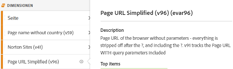
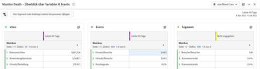

# Adobe Analytics-Implementierungs-Playbook herunterladen

Bevor Sie beginnen, [Playbook herunterladen](assets/aa-implementation-playbook.xlsx).

## Registerkarte &quot;Geschäftsanforderungen&quot;

**WAS:** Ein Business Requirements Doc (allgemein als BRD bezeichnet) ist eine sehr wichtige Dokumentation, an der wichtige Interessengruppen, Geschäftsbenutzer und technische Anwender zusammenarbeiten möchten. Hier können Sie alle gewünschten KPIs, Reporting-Anforderungen und jeden Datenpunkt dokumentieren, den Sie nach Abschluss der Adobe Analytics (AA)-Implementierung sehen möchten.

**WARUM:** Dies dient als Sprungpunkt für die nachfolgende Dokumentation (SDR, technische Spezifikationen usw.) und ist eine gemeinsame Quelle der Wahrheit für einen vereinbarten Endzustand von AA. In diesem Dokument werden die Gedanken über Teams innerhalb der Organisation hinweg organisiert, um eine Orientierung zu geben und Ihre Implementierung weiter zu entwickeln oder zu verbessern.

**WIE:** Die Dokumentation der Geschäftsanforderungen wird in der Regel von den geschäftlichen Endbenutzern von AA durchgeführt. Es ist jedoch wichtig, Feedback von technischen Anwendern zu erhalten, da technische Herausforderungen zu beachten sind und bestimmte Datenpunkte möglicherweise mehr Aufwand erfordern als andere, was wiederum zu einer Priorisierung führt.

Fragen Sie sich selbst: &quot;Was sind die Dinge, die wir auf unserer Site verfolgen möchten&quot;, &quot;Welche Datenpunkte sind für mich bei der Verwendung von Berichten wichtig&quot; und vor allem &quot;Wie werden diese Datenpunkte Entscheidungen beeinflussen&quot;. Es ist wichtig sicherzustellen, dass jede Ihrer geschäftlichen Anforderungen sich auf einen Datenpunkt bezieht, der zur Information von Geschäftsentscheidungen verwendet werden kann. Es kann zum Beispiel verlockend sein, jeden Klick auf Ihre Site zu verfolgen, aber welche Erkenntnisse ziehen Sie am Ende des Tages aus diesem Bericht?

Füllen Sie zunächst Spalte C im folgenden Screenshot aus (Geschäftsanforderung). Dabei sollte es sich beispielsweise um &quot;Wie viele interne Suchvorgänge auf unserer Site durchgeführt werden&quot;oder &quot;Welcher interne Kampagnenspot ist hinsichtlich der Impressionen am effektivsten&quot; handeln. Nachdem Sie diese Detailtiefe ausgefüllt haben, können Sie die Spalte B (Kategorie) ausfüllen und die Anforderungen in Kategorien wie &quot;Suche&quot;oder &quot;Interne Promo&quot;gruppieren, die Ihren technischen Spezifikationen entsprechen sollten.

Sie geben außerdem an, ob Sie der Meinung sind, dass durch die Verwendung von eVar, Ereignissen, Eigenschaften oder Kombinationen das erreicht wird, was Sie verfolgen möchten.

Schließlich dient die Spalte Implementierungsstatus als Statusprüfung, wenn Sie Ihrer Site Elemente hinzufügen.

## Registerkarte &quot;Variablenzuordnung&quot;(Tagging von Dokumenten/SDR)

**WAS:** Ein Tagging-Dokument (häufig als SDR bezeichnet) ist eine wichtige Dokumentation, die sowohl für Technologie- als auch für Geschäftsbenutzer von AA nützlich ist. Er listet alle Variablen auf, die von Report Suites verwendet werden, sowie alle relevanten Details zu den Variableneinstellungen, zur Implementierung der Variablen und zu ihrem Zweck in der Berichterstellung. Wie Ihr Eigenschaftendokument sollte es sich um ein lebendiges, gut verwaltetes Excel-Dokument handeln, in dem eine zentrale Person für die Aktualisierung zuständig ist, da Tagging-Verbesserungen oder Implementierungsänderungen eingeführt werden.

**WARUM:** Dieses Dokument dient vielen Zwecken, aber die wichtigsten sind:

* Für alle neuen Benutzer Ihrer Implementierung (neue Einstellung, Business Owner, der die verfügbaren Berichte besser verstehen möchte usw.) Dieses Dokument bietet eine optimale Übersicht über alle implementierten Variablen und deren Zweck, damit sich Einzelpersonen bei der Erforschung Ihres AA-Setups selbst bedienen können.
* Für den AA-Produkteigentümer/-Technikbenutzer dient dieses Dokument als Erinnerung daran, wie andere Variablen eingerichtet werden und welche Variablen beim Hinzufügen einer neuen Dimension verwendet werden können.

**WIE:** Beginnen Sie mit der Auflistung aller vordefinierten Adobe-Variablen (Seite, Produkt, geografische Angaben usw.) sowie eVars, Props, Ereignisse und Listenvariablen in einem Excel-Dokument. Dieser sollte eine Registerkarte pro Site/Report Suite enthalten.
Für jede dieser Dimensionen werden die folgenden Spalten hinzugefügt:
* **Name:** Geben Sie einen einfachen und kurzen Namen an, den die meisten verstehen können. Dies sollte intuitiv genug sein, damit ein neuer Benutzer sie abrufen und verstehen kann, was die Variable erfassen soll.
* **Beschreibung:** Detaillierte Informationen dazu, wofür die Variable verwendet wird und welche Daten sie verfolgt. Ich halte dies kurz und einfach und habe es mit der Beschreibung in der Benutzeroberfläche übereinstimmen. Idealerweise möchte ich nicht, dass meine Benutzer das Tagging-Dokument lesen müssen. Wenn also eine neue Dimension im Admin-Backend eingerichtet wird, füge ich dort dieselbe Beschreibung hinzu. Auf diese Weise kann der Benutzer direkt in Workspace auf das Informationssymbol klicken, um zu verstehen, was eine Dimension ist - kein Excel-Dokument abrufen!

* **Code:** Der Code aus dem Backend, der den Wert festlegt. Dies kann das Feld aus der Datenschicht auf der Seite sein oder Sie können darauf hinweisen, dass dies mit einer Launch-Regel, einer Verarbeitungsregel usw. geschieht.
* **Klassifizierungsberichte:** Classification Importer oder Classification Rule Builder verwenden, um alle Classification-Berichte aufzurufen
* **Lösungsbereich:** Ich finde es nützlich, alle Eigenschaften (zumindest diejenigen, die mehr als Standardvariablen verwenden) in kleinen Spalten aufzulisten und ein Häkchen für jede Dimension hinzuzufügen, die für diese Eigenschaft festgelegt wird. Auf diese Weise können Sie einfach nach einer bestimmten Eigenschaft filtern und schnell erkennen, wo eine bestimmte Dimension festgelegt wird.
* **Konfiguration:** Admin-UI-Einstellungen für jede Variable (d. h. für eVars - Ablauf, Zuordnung, Merchandising usw.)

Screenshot der Beispiel-SDR:

Es wird außerdem empfohlen, dieses Tagging-Dokument zu verwenden, um freie Variablen und alle &quot;Junk&quot;-Variablen zu verfolgen. Wenn eine Dimension nicht mehr nützlich ist, braucht die Entwicklung normalerweise eine Weile, um sie zu löschen. Selbst danach kann das Caching stattfinden, oder Sie können erkennen, dass die Dimension auch an anderer Stelle festgelegt wurde. Das Bereinigen von Dimensionen ist nicht einfach und erfordert oft Geduld. Hier sind einige Tipps, wie Sie Ihren Junk unter dem Bett verstecken können, damit Ihre Benutzer nicht verwirrt werden, während Sie ihn verfolgen.

* Alle nicht verwendeten Dimensionen/Ereignisse sind entweder &quot;kostenlos&quot;oder &quot;werden gelöscht&quot;
   * Wenn die Dimension in den letzten 90 Tagen Junk-Werte aufweist, wird sie &quot;gelöscht&quot;
   * Wenn die Dimension mindestens für die letzten 90 Tage frei und klar ist, ist sie &quot;kostenlos&quot;
   * Markieren Sie diese als solche unter &quot;Name&quot;im Tagging-Dokument, damit Sie sie einfach filtern können. Diese sind im Tagging-Dokument (Excel-Datenfilter) deaktiviert, damit sie Benutzern nicht angezeigt werden
   * Markieren Sie diese als eVar in der Benutzeroberfläche, damit Benutzer sie nicht in einer Suche finden (d. h. &#39;(v6)&#39;) und entfernen Sie die Beschreibung in der Benutzeroberfläche
* Wenn eine neue Dimension benötigt wird, können Sie in der Spalte &quot;Name&quot;einfach nach &quot;kostenlos&quot;filtern, um eine saubere Dimension zu finden, die verwendet werden kann
* Für die Dimensionen und Ereignisse, die gelöscht werden, empfehlen wir, diese mit Workspace zu verfolgen:
   * Erstellen Sie ein Projekt, das nur für Administratoren mit 3 Tabellen sichtbar ist: eVars, Props und Ereignisse. Ich verwende &quot;Instanzen&quot;für die spezifischen eVars, und für Props erstelle ich HIT-Segmente mit &quot;prop5 ist vorhanden&quot;.
   * Datum auf Letzte 90 Tage festlegen
   * Verwenden Sie die oben genannten Zeilen in den 3 Tabellen zusammen mit Vorfällen.
   * Sobald etwas auf &quot;0&quot;gelangt, markiere ich es im Tagging-Dokument als &quot;kostenlos&quot;und entfernt es aus dem Workspace-Projekt

Auf diese Weise werden Ihre Daten immer sauber und Sie haben eine klare Vorstellung von Ihrem Junk.

## Registerkarte &quot;Eigenschaften&quot;

**WAS:** In einem Eigenschaftendokument sollten all Ihre digitalen Eigenschaften - Websites, mobile Apps, andere Tools (Chat, Feedback usw.) aufgelistet werden, unabhängig davon, ob diese Eigenschaften mit Adobe Analytics getaggt sind oder nicht. Dies sollte als zentralisiertes, lebendiges Dokument für geschäftliche und technische Anwender dienen.

**WARUM:** Dadurch erhalten Sie einen klaren Überblick über die Journey Ihres Benutzers in all Ihren digitalen Eigenschaften und darüber, was Adobe Analytics tut und nicht abdeckt, sodass Sie beginnen können, das Hinzufügen von Tags zu allen Eigenschaften, in denen sie fehlt, zu priorisieren. Indem Sie Ihr digitales Ökosystem auf diese Weise gestalten, können Sie potenzielle Möglichkeiten bei der Tagging-Strategie erkennen, um einen umfassenden Überblick über die Journey Ihrer Benutzer zu erhalten. Benötigen Sie beispielsweise eine globale Report Suite, um die Verfolgung über mehrere Domänen/Sites hinweg durchzuführen? Ist eine Übergabe der Besucher-ID zwischen Domänen oder App- an Hybriderlebnissen erforderlich? Müssen interne URL-Filter für domänenübergreifendes Tracking aktualisiert werden?

**WIE:** Identifizieren Sie einen Eigentümer des Dokuments, um die Governance und eine einzige Quelle der Verantwortung für die Verwaltung von Aktualisierungen bereitzustellen.
Geben Sie auf der Registerkarte &quot;Eigenschaften&quot;Folgendes an:
* **Eigenschaftsname:** Dabei kann es sich um eine Domäne, Subdomäne, App-Name usw. handeln. Selbst innerhalb derselben Domäne sollten Teile davon getrennt werden, wenn sie separat verwaltet werden (z. B. von einem anderen Team oder einer anderen Technologie).
* **Link (URL)** zu Eigenschaft, sofern verfügbar
* **Inhaber und Ansprechpartner:** Haupteigentümer oder Hauptkontakte für die Eigenschaft auflisten
* **Tag-Methode:** Viele von uns verfügen über verschiedene Code-Methoden und -Implementierungen (Launch, JS-Dateien, AEP usw.). Sie können dies bei Bedarf weiter aufschlüsseln (z. B. nach Codeversion oder Tag-Management-System). Dies dient jedoch dazu, alle Ihre verschiedenen Code-Methoden und -Versionen zu verfolgen, wo der Code aktualisiert werden muss und wie er gepflegt werden muss. Wenn Sie Adobe Launch verwenden, geben Sie den Namen der Launch-Eigenschaft an.

Denken Sie daran, alle digitalen Eigenschaften einzuschließen, auch wenn sie nicht mit Adobe Analytics getaggt sind. Auf diese Weise können Sie Ihre digitale Landschaft und die Interaktion Ihrer Benutzer mit all Ihren Eigenschaften verstehen.

Es wird empfohlen, dieses Dokument so einfach wie möglich zu halten und es nicht mit zu vielen Informationen zu verschlüsseln, damit es von verschiedenen Teilen der Organisation leicht interpretiert werden kann. Analytics-Teams verstehen die digitale Landschaft oft besser als jedes andere Team. Daher wird dieses Dokument häufig von anderen Teams und Führungskräften verwendet, um einen umfassenden Überblick zu bieten.

>[!TIP]
>
>Erstellen Sie eine Dimension für den Site-Namen/die Eigenschaft in Adobe Analytics. Eine spezielle Dimension (normalerweise eine eVar) in Adobe Analytics, die den Site-Namen/App-Namen identifiziert, ermöglicht die Segmentierung, Fehlerbehebung, Erstellung einer Virtual Report Suite usw. Die Vorteile sind unbegrenzt, insbesondere wenn mehrere Sites in einer (globalen) Report Suite kombiniert werden. Der Schlüssel besteht darin sicherzustellen, dass Ihre Entwicklungsteams diesen Wert immer in der Dimension &quot;Eigenschaften&quot;festlegen, einschließlich aller Seitenladevorgänge (s.t-Aufrufe/trackState) und aller benutzerspezifischen Ereignisse (s.tl-Aufrufe/trackAction). Verarbeitungsregeln können ein nützliches Tool sein, um Sie bei der korrekten und konsistenten Festlegung dieser Werte zu unterstützen.

[Dieses Video von Doug Moore ansehen](https://experienceleague.adobe.com/docs/analytics-learn/tutorials/implementation/implementation-basics/creating-a-business-requirements-document.html){target=&quot;_blank&quot;} für weitere Informationen zum Ausfüllen des Implementierungs-Playbooks.

## Autoren

Dieses Dokument wurde von folgenden Personen mitgeschrieben:

Christel Guidon, Digital Analytics Platform Manager bei NortonLifeLock Adobe Analytics Champion

Rachel Fenwick, Senior Consultant bei Adobe
