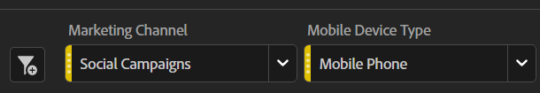

# Mit zusammenfassenden Dashboards für Führungskräfte zum Erfolg

_Führungskräfte verfügen häufig nicht über aktuelle und relevante Informationen für ihre Sites und Apps. Sie verlassen sich auf monatliche Excel-Diagramme oder ertrinken in granularen Daten. Die Lösung: ein zusammenfassendes Dashboard für Führungskräfte._

Ich möchte, dass Sie sich vorstellen, von Seattle nach San Francisco zu fahren. Was die Richtung angeht, ist das ziemlich einfach. Fahren Sie die I-5 Richtung Süden, und in zwölf bis sechzehn Stunden sind Sie dort. Einfach, nicht wahr? Stellen Sie sich vor, ich habe ein Stück Pappe über Ihr Armaturenbrett gelegt, und ich sage Ihnen das am Ende
Während Ihrer Reise erhalten Sie ein Dashboard, das Ihnen Ihre Geschwindigkeit, Ihren Kraftstoffstand und die zurückgelegte Strecke mitteilt:

Beim Blick auf das Diagramm werden Sie vermutlich ein paar Dinge feststellen:

1. Ihre Geschwindigkeit ist enorm geschwankt, war an einigen Stellen deutlich über der gesetzlichen Geschwindigkeitsbegrenzung und an anderen Stellen sehr langsam – zum Beispiel wegen des Verkehres in Portland

1. Für die Stunden 6 bis 9 ist die zurückgelegte Strecke statisch

1. Das liegt daran, dass Ihr Treibstoff auf 0 % gesunken ist und Sie auf die Pannenhilfe warten mussten, um durch den Portland-Verkehr zu kommen und wieder aufzutanken

Eine solche Reise wäre offensichtlich schrecklich, unvorhersehbar und gefährlich. So kann man wirklich nicht fahren. Sie benötigen kontinuierliche Informationen über Geschwindigkeit, zurückgelegte Entfernung und Tankfüllstand, um laufend Änderungen an der Fahrweise vornehmen zu können. Zweifellos würde ein vernünftiger Mensch die Pappe vom Dashboard reißen und regelmäßig darauf sehen. Dies würde die Reisedauer verkürzen, das Risiko, den Tank leerzufahren, fast eliminieren, und auch eine Geschwindigkeitsübertretung ließe sich so einfach vermeiden.

Warum also akzeptieren so viele Führungskräfte dies als vernünftigen Weg, um ihre Websites und Apps zu betreiben?

Viele Führungskräfte haben keinen Zugriff auf laufende, relevante Informationen, die erforderlich sind, um rechtzeitig Maßnahmen ergreifen zu können. Stattdessen erhalten sie einmal monatlich ein Deck mit Statistiken, die von Adobe Analytics in Excel exportiert, grafisch aufbereitet und dann in eine PowerPoint-Präsentation gesteckt werden. Wenn Anfang des Monats ein Wendepunkt auftritt, erfahren sie erst Anfang des nächsten Monats davon, lange, nachdem sie hätten Fragen stellen oder Maßnahmen ergreifen können. Benutzerdefinierte Warnhinweise sind ebenfalls eine großartige Option, aber wir alle wissen, wie der E-Mail-Posteingang einer Führungskraft aussieht.

Führungskräfte sollten genügend Daten haben, um zu wissen, wann ihre Aufmerksamkeit sofort benötigt wird, und nicht so viele, dass sie die Hände überm Kopf zusammenschlagen. Wenn Sie von einer oder einem Produktverantwortlichen oder einem Marketing-Manager die Nachricht erhalten, dass eine Führungskraft Fragen über eine Anomalie hat, dann ist die ideale Datenmenge gut getroffen.

Das zusammenfassende Dashboard schlägt diesen guten Mittelweg ein. Wir wissen, dass sich die mobile Scorecard gut für eine Führungskraft eignet, die gleich losmuss und noch einmal einen schnellen Blick auf die Daten werfen möchte. Ein „Executive Summary Dashboard“ kann es Führungskräften jedoch einfacher machen, einen genaueren Blick zu werfen, wenn sie an ihrem Schreibtisch sind. Die mobile Scorecard kann sie auf ein Problem aufmerksam machen, aber das Executive Summary Dashboard ermöglicht ihnen dann, genug zu verstehen, um den richtigen Leuten die richtigen Fragen stellen zu können.

Die meisten Führungskräfte haben etwa drei KPIs, die ihnen sehr wichtig sind. Im Einzelhandel könnte dies Bestellungen, Umsatz und durchschnittlicher Bestellwert sein. Für B2B könnte dies Leads, Lead-Qualität und Konversionsrate sein. Services könnten an Besuchen, Terminen und wiederkehrenden Besuchern interessiert sein. Welche drei KPIs es auch sind: Schreiben Sie sie groß, mit fetten Zahlen, mit der Änderung im Jahresvergleich und einem Diagramm. Die Visualisierung der Schlüsselmetrik-Zusammenfassung macht dies so einfach:

Fügen Sie historische Daten für dieselben drei Metriken hinzu, damit sich langfristige Trends leicht erkennen lassen:

Fügen Sie ein paar Dropdown-Listen für alles hinzu, was für Ihre Organisation wichtig ist. Ich finde, dass Gerätetyp und Marketing-Kanal normalerweise eine gute Wahl sind:

Diese beiden sind insgesamt ziemlich wichtig, doch Sie sollten in jedem Fall sicherstellen, dass das, was Sie auswählen, relevant für Ihre Site oder App ist.

Fügen Sie abschließend einige Details hinzu. Ich finde, dass die Seitenleistung bei Führungskräften häufig beliebt ist, aber der Schlüssel ist, dass sie unter dem Hauptaugenmerk liegt. Führungskräfte können sie einsehen, wenn sie es wünschen, doch ansonsten haben Sie die Daten, die sie benötigen, um sofort Fragen stellen zu können:

Mit diesem fertigen Produkt müssen Sie nur:

- Ihre Führungskräfte darin schulen, wie es zu lesen ist

- sie darin schulen, wie die Filter zu verwenden sind

- sie darin schulen, einen einfachen Drilldown durchzuführen

- Holen Sie sich einen Kaffee und machen Sie sich bereit, denn wenn die Führungskräfte mit Daten präpariert sind, werden sie mit vielen Fragen zu Ihnen kommen

Halten wir fest: Zusammenfassende Dashboards bieten fortlaufende, relevante Informationen für eine zeitnahe Entscheidungsfindung. Monatliche Decks mit Excel-Diagrammen sind unzureichend, und zu viele granulare Daten können Führungskräfte überfordern. Ein guter Mittelweg besteht darin, sich auf die drei wichtigsten KPIs mit historischen Daten und Dropdown-Listen für relevante Faktoren zu konzentrieren. Durch Schulung
Führungskräfte können fundierte Entscheidungen über die Verwendung des Dashboards treffen und Fragen stellen. Zusammenfassende Dashboards für Führungskräfte können die Site- und App-Leistung verbessern und den Erfolg voranbringen.

## Autor

Dieses Dokument wurde verfasst von:

**Gitai Ben-Ammi**, Principal Consultant bei Concentrix Catalyst

Adobe Analytics-Experte
