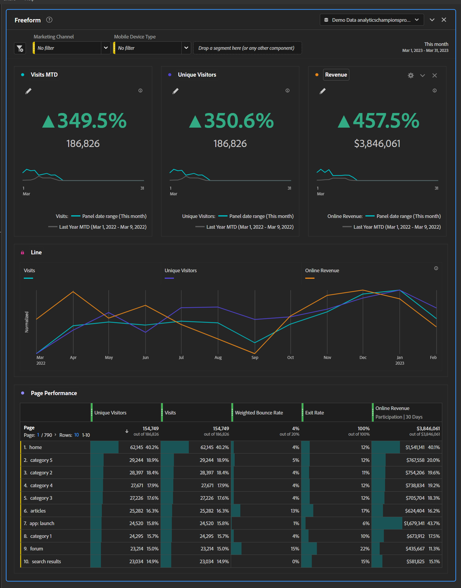

# Erfolgreiche Ausführung von Zusammenfassungs-Dashboards

_Führungskräfte verfügen häufig nicht über aktuelle und relevante Informationen für ihre Sites und Apps, da sie sich auf monatliche Excel-Diagramme verlassen oder granulare Daten ertrinken. Die Lösung: Dashboard der ausführlichen Zusammenfassung._

Ich möchte, dass Sie sich vorstellen, von Seattle nach San Francisco zu fahren. Richtung, es ist ziemlich einfach. Steigen Sie auf die I-5 Süd für zwölf bis sechzehn Stunden und Sie sind dort. Einfach, nicht wahr? Ich möchte, dass Sie sich vorstellen, ich habe ein Stück Pappe über Ihr Dashboard gelegt, und ich sage Ihnen, dass Sie am Ende Ihrer Reise ein Dashboard erhalten, das Ihnen Ihre Geschwindigkeit, Kraftstoffmengen und zurückgelegte Entfernung anzeigt:

Wenn Sie die Grafik untersuchen, werden Sie möglicherweise einige Dinge bemerken:

1. Ihre Geschwindigkeit variierte sehr, sehr weit über die gesetzliche Geschwindigkeitsbegrenzung an einigen Punkten, und sehr niedrig an anderen Punkten wegen Dingen wie Portland Traffic

1. Die zurückgelegte Strecke ist statisch für Stunden 6-9

1. Das liegt daran, dass Ihr Treibstoff auf 0 % gesunken ist und Sie auf Straßenhilfe warten mussten, um durch den Portland-Verkehr zu kommen und Ihren Tanktank wieder aufzufüllen

Eine solche Reise wäre offensichtlich miserabel, unvorhersehbar und gefährlich. Es ist keine Möglichkeit zu fahren. Sie benötigen kontinuierliche Informationen über Geschwindigkeit, zurückgelegte Entfernung und Kraftstoffspiegel, um laufend Änderungen an der Fahrweise vornehmen zu können. Zweifellos würde eine vernünftige Person das Karton vom Dashboard abreißen und regelmäßig überprüfen, was die Reisedauer verkürzt, das Risiko, dass es zu wenig Gas gibt, fast eliminiert und Sie bei der richtigen Geschwindigkeit bewegen würde, um ein schnelleres Ticket zu vermeiden.

Warum also akzeptieren so viele Führungskräfte dies als vernünftigen Weg, ihre Websites und Apps zu betreiben?

Viele Führungskräfte haben keinen Zugriff auf laufende, relevante Informationen, die erforderlich sind, um rechtzeitig Maßnahmen zu ergreifen. Stattdessen erhalten sie einmal monatlich ein Deck mit Statistiken, die von Adobe Analytics in Excel exportiert, gechartert und dann in einen PowerPoint geploppt werden. Wenn Anfang des Monats ein Wendepunkt auftritt, werden sie erst Anfang des nächsten Monats davon erfahren, lange nachdem sie Fragen stellen oder Maßnahmen ergreifen können. Benutzerdefinierte Warnhinweise sind ebenfalls eine großartige Option, aber wir alle wissen, wie der E-Mail-Posteingang eines Exec aussieht.

Sie wollen, dass Führungskräfte genügend Daten haben, um zu wissen, wann ihre Aufmerksamkeit sofort benötigt wird, und nicht so sehr, dass sie ihre Hände in Frustration stecken. Wenn Sie von einem Produkteigentümer oder Marketing-Manager zu einer Meldung gelangen, dass ein Exec von einer Anomalie erfahren möchte, treffen Sie auf den &quot;Guten Ort&quot;.

Hier wird das Dashboard der ausführenden Zusammenfassung als glückliches Medium angezeigt. Wir wissen, dass die mobile Scorecard für einen schnellen Check-in für einen Ausflug auf dem Weg ist, aber ein Executive Summary Dashboard kann es für Führungskräfte leicht machen, etwas tiefer einzugraben, wenn sie sich an ihren Schreibtischen befinden. Die mobile Scorecard kann sie auf ein Problem aufmerksam machen, aber das Executive Summary Dashboard ermöglicht ihnen, dann genug zu verstehen, um die richtigen Fragen von den richtigen Personen zu stellen.

Die meisten Führungskräfte verfügen über etwa drei KPIs, mit denen sie sich sehr beschäftigen. Im Einzelhandel kann es sich um Bestellungen, Umsatz und AOV handeln. Für B2B: Leads, Lead-Qualität und Konversionsrate. Services können an Besuchen, Terminen und wiederkehrenden Besuchern interessiert sein. Was auch immer die drei sind, stecken Sie sie in große, fette Zahlen mit einer Jahresänderung und einer Grafik. Die Visualisierung der Schlüsselmetrik-Zusammenfassung macht dies so einfach:

Fügen Sie historische Daten für dieselben drei Metriken hinzu, damit sich langfristige Trends leicht erkennen lassen:

Fügen Sie in ein paar Dropdown-Listen für alles hinzu, was für Ihre Organisation wichtig ist. Ich finde, dass Gerätetyp und Marketing-Kanal normalerweise gute Wetten sind:

Diese beiden sind insgesamt ziemlich wichtig, stellen aber wie immer sicher, dass das, was Sie auswählen, für Ihre Site oder App relevant ist.

Fügen Sie abschließend einige Details hinzu. Ich finde, dass die Seitenleistung bei Führungskräften häufig beliebt ist, aber der Schlüssel ist, dass sie unter der Kante liegt. Sie können es suchen, wenn sie es wünschen, aber andernfalls verfügen sie über die Daten, die sie benötigen, um sofort Fragen zu stellen:

Mit diesem fertigen Produkt müssen Sie nur:

- Trainieren von Führungskräften beim Lesen

- Trainieren der Filter

- Trainieren Sie sie mit einem einfachen Drilldown.

- Holen Sie sich Kaffee und bereiten Sie sich vor, denn nachdem sie mit Daten ausgestattet sind, werden Führungskräfte Ihnen viele Fragen stellen

Zusammenfassende Dashboards bieten fortlaufende, relevante Informationen für eine zeitnahe Entscheidungsfindung. Monatliche Decks mit Excel-Diagrammen sind unzureichend und die Bereitstellung zu detaillierter Daten kann Führungskräfte überfordern. Ein glückliches Medium besteht darin, sich auf die drei wichtigsten KPIs mit historischen Daten und Dropdown-Listen für relevante Faktoren zu konzentrieren. Durch die Schulung von Führungskräften in der Nutzung des Dashboards können sie fundierte Entscheidungen treffen und Fragen stellen. Die ausführlichen Zusammenfassungs-Dashboards können die Site- und App-Leistung verbessern und den Erfolg steigern.

## Autor

Dieses Dokument wurde verfasst von:

**Gitai Ben-Ammi**, Hauptberater bei Concentrix Catalyst

Adobe Analytics-Experte
