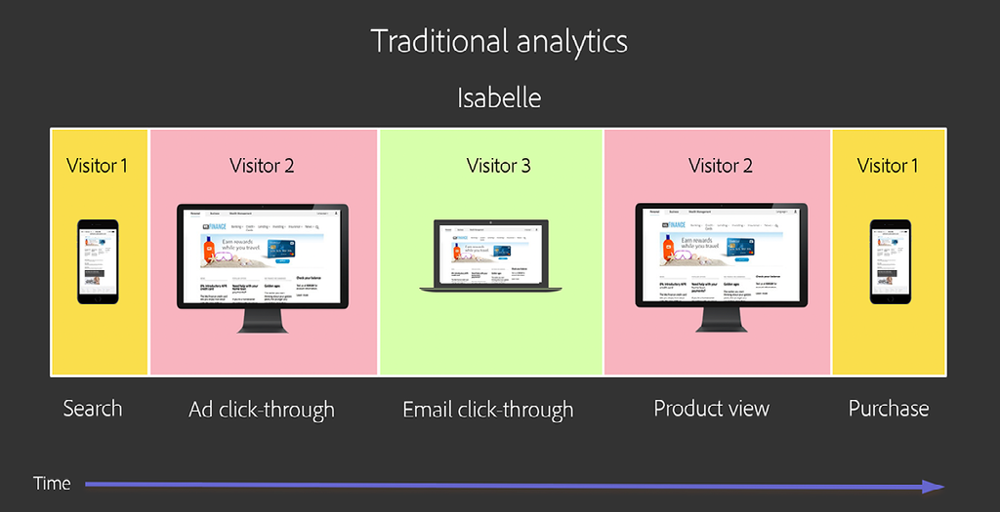

# Grundlagen und Verwendung von [!DNL Journey IQ] – Geräteübergreifende Analyse

Wenn Benutzer mit Ihrer Marke interagieren, tun sie dies auf viele Arten und auf mehreren Geräten. Die geräteübergreifende Analyse kann mit dem [!DNL Adobe Experience Platform Identity Service] integriert werden, um zu ermitteln, wie Geräte Personen zugeordnet sind. Anschließend nutzt sie diese Intelligenz, um eine geräteübergreifende Ansicht des Benutzerverhaltens zu erstellen. Dies führt dazu, dass Analysen zu Personen durchgeführt werden können, statt zu Geräten.

## Überblick über die geräteübergreifende Analyse

### Ich bin nicht meine Geräte

Wenn Benutzer mit Ihrer Marke interagieren, tun sie dies auf viele Arten und auf mehreren „Oberflächen“ oder „Geräten“. Sie können einen Webbrowser auf einem PC oder Mobilgerät oder eine Mobile App verwenden. In der herkömmlichen digitalen Analyse, die mit der Datenerfassung auf der Basis von Cookies entwickelt wurde, wird jede dieser Oberflächen als einzigartiger „Besucher“ (Unique Visitor) dargestellt. Das bedeutet, dass jeder Ihrer menschlichen Benutzer als mehrere Unique Visitors dargestellt wird.

Hier ein Beispiel. Nehmen wir an, Isabelle hat wie folgt mit Ihrer Marke interagiert:

*Isabelle ist drei Besucher*

Isabelles Journey wird auf der Grundlage herkömmlicher Analysen in drei Teile zerteilt. Sie wird als drei Unique Visitors dargestellt, von denen jeder ein anderes Gerät zur Durchführung isolierter Aufgaben verwendet hat. Was wir brauchen, ist eine einheitliche, geräteübergreifende Sicht auf die Interaktionen von Isabelle. [!DNL Journey IQ: Cross-Device Analytics] bietet diese Ansicht.

*Isabelle ist eine Person*

### Eine geräteübergreifende Ansicht bietet bessere Analysen

Eine personenorientierte, geräteübergreifende Betrachtung des Verhaltens von Isabelle kann für Ihre Analyse einen wesentlichen Unterschied darstellen. Der herkömmliche besucherbasierte Ansatz vermittelt Ihnen beispielsweise kein vollständiges Bild der Effektivität des Marketing-Kanals. Schauen wir uns noch einmal die Journey von Isabelle an mit Schwerpunkt darauf, welcher Kanal für ihre Produktansicht und welcher für ihren Kauf verantwortlich ist. Der Einfachheit halber verwenden wir die Attribution [!UICONTROL Letztkontakt], aber dasselbe Problem tritt bei der Verwendung eines beliebigen Attributionsmodells auf, wenn Sie Isabelles Verhalten in separate Besucher unterteilen. Die Verwendung der traditionellen Besucher-basierten Sicht auf die Welt liefert sehr unterschiedliche, sogar irreführende Ergebnisse:

*Herkömmliche Analyse vs. geräteübergreifende Analyse*

Beachten Sie, dass der E-Mail-Kanal bei der geräteübergreifenden Ansicht sowohl für die Produktansicht als auch für den Kauf gewertet wird, was Isabelles reales Erlebnis genauer widerspiegelt.

Lesen Sie weiter, um mehr über Folgendes zu erfahren:

* Funktionsweise von [!DNL Cross-Device Analytics]
* Voraussetzungen für [!DNL Cross-Device Analytics]
* Interpretieren geräteübergreifender Daten
* Analysieren geräteübergreifender Daten in Analysis Workspace

## Funktionsweise von [!DNL Cross-Device Analytics]

[!DNL Journey IQ: Cross-Device Analytics (CDA)] ist mit [!DNL Adobe Experience Platform Identity Service] integriert, wobei [!DNL Device Graph] verwendet wird, um die Zuordnung von Geräten zu Personen zu ermitteln. Anschließend nutzt sie diese Intelligenz, um eine geräteübergreifende Ansicht des Benutzerverhaltens zu erstellen. Die geräteübergreifende Analyse umfasst unübertroffene Funktionen und Tools, mit denen Ihr Unternehmen die Nutzung mehrerer Geräte und das Kundenerlebnis auf diesen Geräten bei der Interaktion mit Ihrer Marke verstehen kann. Sie befindet sich als Ebene unter Analysis Workspace, um tiefe Einblicke in die personenbasierte Zielgruppenanalyse und geräteübergreifende Attribution, Segmentierung und Journey-Analyse mit leistungsstarken Tools wie [!UICONTROL Fallout], [!DNL Flow], [!DNL Cohort], [!DNL Segment IQ] und [!DNL Attribution IQ] zu ermöglichen.

### Die [!DNL Cross-Device Virtual Report Suite]

Die geräteübergreifende Analyse wird durch eine spezielle Art von geräteübergreifender [[!UICONTROL Virtual Report Suite]](https://experienceleague.adobe.com/docs/analytics/components/virtual-report-suites/vrs-about.html?lang=de) dargestellt. Auf diese Weise können Sie die ursprüngliche gerätebasierte Report Suite weiterhin verwenden, während Sie geräteübergreifende Analysen in Ihre Organisation einführen. Das Einrichten einer Virtual Report Suite (VRS) für die geräteübergreifende Analyse (Cross-Device Analytics, CDA) ist einfach.

Wählen Sie in Schritt 1 des VRS-Builders die [!UICONTROL Report Suite], die von Adobe als CDA-fähig konfiguriert wurde:

*CDA-fähige Basis auswählen (Quelle) [!UICONTROL Report Suite]*
![[!UICONTROL Virtual Report Suite] Schritt 1](assets/cda-vrs-step-one.png)

Aktivieren Sie dann die [!UICONTROL Berichtszeitverarbeitung] und aktivieren Sie das [!UICONTROL Geräte-Stitching]:

*Aktivieren von [!UICONTROL Berichtszeitverarbeitung] und [!UICONTROL Geräte-Stitching]*
![[!UICONTROL Virtual Report Suite] Schritt 2](assets/cda-vrs-step-two.png)

Schließen Sie das VRS-Setup ab und speichern Sie es. Die VRS für die geräteübergreifende Analyse wird in Analysis Workspace mit einem speziellen Symbol daneben angezeigt, wie unten dargestellt:

*CDA-VRS in Analysis Workspace auswählen*
![[!UICONTROL Virtual Report Suite] Schritt 3](assets/cda-vrs-step-three.png)

>[!TIP]
>
>Zusätzlich zur CDA-fähigen [!UICONTROL Report Suite] als Basis können Sie so viele [!UICONTROL Virtual Report Suites] mit CDA erstellen, wie Sie möchten.

### Wiederherstellen des Verlaufs

Manchmal dauert es eine Weile, bis sich Ihre Benutzer anmelden und [!DNL Device Graph] sie identifizieren und ihre Geräte zuordnen kann. Die geräteübergreifende Analyse verwendet ein 30-tägiges Lookback-Fenster, sodass ein zuvor nicht identifizierter Besucher bis zu 30 Tage in der Vergangenheit als Person erneut angezeigt werden kann.

Wie hilft das? Erinnern Sie sich an die Customer Journey von Isabelle aus der obigen Diskussion:

![[!DNL Cross-Device Analytics] Journey](assets/cda-isabelle-journey-cross-device-analytics.png)

Es ist möglich, dass sich Isabelle erst unmittelbar vor dem Kauf angemeldet hat und dass [!DNL Device Graph] die Geräte von Isabelle erst irgendwann nach ihrem Kauf zugeordnet hat. Aber der 30-tägige Lookback-Zeitraum der CDA ermöglicht es der CDA, Isabelles vergangenes Verhalten auf Personenebene erneut darzustellen und Ihnen die geräteübergreifende Ansicht ihrer benötigten Journey zu liefern.

>[!NOTE]
>
>Da der Verlauf neu angegeben werden kann, können sich Ihre Daten im Laufe der Zeit in einer CDA-fähigen [!UICONTROL Virtual Report Suite] ändern. Beachten Sie dies bei der Kommunikation von Einblicken aus einer CDA-basierten Analyse.

## Voraussetzungen für [!UICONTROL geräteübergreifende Analyse]

CDA ist enthalten in [[!DNL Analytics Ultimate]](https://helpx.adobe.com/de/legal/product-descriptions/adobe-analytics.html). Ab September 2019 können [!DNL Analytics Ultimate]-Kunden, die die unten aufgeführten Voraussetzungen erfüllen, die geräteübergreifende Analyse nutzen. Die Voraussetzungen für die geräteübergreifende Analyse lauten wie folgt:

* Ihr Unternehmen muss [!DNL Adobe Experience Platform Identity Service Device Graph]. verwenden.
* Sie müssen alles implementieren, was für [!DNL Device Graph] erforderlich ist, einschließlich die [Experience Cloud ID (ECID)](https://experienceleague.adobe.com/docs/id-service/using/home.html?lang=de) und die ID-Synchronisierung mit dem Graphen.
* Es ist derzeit nicht möglich, zwei IMS-Organisationen mit einem [!DNL Device Graph] zu verwenden, sodass Sie eine Standardisierung für eine einzige IMS-Organisation durchführen müssen.
* [!DNL Device Graph] sowie bestimmte Komponenten von CDA werden in [!DNL Microsoft Azure] gehostet. Das bedeutet, dass [!DNL Analytics]-Daten zwischen dem Rechenzentrum von Adobe und der Adobe-Präsenz in [!DNL Microsoft Azure] hin und her kopiert werden. Einige [!DNL Analytics]-Daten werden in [!DNL Azure] gespeichert. Ihr Unternehmen muss dieser Vereinbarung zustimmen.
* Die geräteübergreifende Analyse erfordert eine „geräteübergreifende“ [!UICONTROL Report Suite]. Das heißt, dass die [!UICONTROL Report Suite], die Sie für die geräteübergreifende Analyse verwenden, Daten von mehreren verschiedenen Gerätetypen oder „Oberflächen“ wie Web auf dem Desktop, Web auf dem Mobilgerät und Mobile App enthalten muss. Seit September 2019 muss das Server-Aufrufvolumen für diese [!UICONTROL Report Suite] 100 Millionen Server-Aufrufe/Tag oder weniger betragen. (Das Volumen der Server-Aufrufe wird in den nächsten Monaten steigen.)

## Interpretieren geräteübergreifender Daten

### Personen, nicht Besucher

Innerhalb der [!UICONTROL Virtual Report Suite] zur geräteübergreifenden Analyse werden Sie einige Änderungen sehen. Beispiel: die Metrik [!UICONTROL Unique Visitors] wird durch zwei neue Metriken ersetzt: [!UICONTROL Personen] und [!UICONTROL Eindeutige Geräte]. Diese neuen Metriken geben Ihnen deutlich bessere Einblicke in die Zielgruppengröße.

*Personen und eindeutige Geräte*
![CDA [!UICONTROL Metrik für Personen]](assets/cda-people-metric.png)

Im [[!UICONTROL Segment Builder]](https://experienceleague.adobe.com/docs/analytics/components/segmentation/segmentation-workflow/seg-build.html?lang=de) wurde der Segment-Container [!UICONTROL Besucher] durch einen Segment-Container [!UICONTROL Person] ersetzt. Mithilfe einer CDA-VRS können Sie geräteübergreifende Segmente erstellen, z. B.:

* Personen, die mehr als ein Gerät verwenden
* Personen, die ihre Journey auf einem Mobilgerät beginnen und dann später auf einem Desktop-Gerät kaufen
* Besuche, bei denen Benutzer mehrere Geräte zur Erfüllung einer Aufgabe verwenden

*Segmente auf Benutzerebene*
![[!DNL Segment Builder] [!UICONTROL Person] Container](assets/cda-segment-builder-person-container.png)

### Persistenz der Dimensionen

Innerhalb einer CDA-VRS werden Dimensionen wie [!DNL eVars] nun automatisch geräteübergreifend beibehalten. Beispiel: eine [!DNL eVar] wird wie folgt konfiguriert:

* Zuordnung: Zuletzt verwendet (Letzter)
* Läuft ab nach: Kauf

wird nun automatisch von einem Gerät zum anderen beibehalten, bis das Kaufereignis ausgelöst wird.

## Analysieren geräteübergreifender Daten in Analysis Workspace

### Personenbasierte Zielgruppenanalyse

Haben Sie sich schon einmal gefragt, wie viele Menschen mit Ihrer Marke interagieren? Wollten Sie gerne wissen, wie viele und welche Arten von Geräten sie verwenden? Wie sich ihre Verwandung überschneidet? Mithilfe einer CDA-VRS können Sie geräteübergreifend [Venn-Diagramme](https://experienceleague.adobe.com/docs/analytics/analyze/analysis-workspace/visualizations/venn.html?lang=de) und [Histogramme](https://experienceleague.adobe.com/docs/analytics/analyze/analysis-workspace/visualizations/histogram.html?lang=de) für die Geräte pro Person erstellen.

*Benutzerbasierte Zielgruppenanalyse*

### Geräteübergreifender [!DNL Flow]

Mit CDA und Analysis Workspace können Sie in der [[!DNL Flow visualization]](https://experienceleague.adobe.com/docs/analytics/analyze/analysis-workspace/visualizations/flow/flow.html?lang=de) visualisieren, wie Benutzer im Zeitverlauf von einem Gerät zum anderen wechseln. Sie können sehen, wo sie ihre Journey abbrechen und wo sie weitermachen.

*[!DNL Flow] mit CDA*
![[!DNL Flow Visualization]](assets/cda-flow-viz.png)

### Geräteübergreifender [!DNL Fallout]

Sie verwenden wahrscheinlich mehrere [[!DNL Fallout visualizations]](https://experienceleague.adobe.com/docs/analytics/analyze/analysis-workspace/visualizations/fallout/fallout-flow.html?lang=de), um zu analysieren, wie gut Benutzer eine bestimmte Reihe von Schritten durchlaufen, bevor sie erfolgreich sind. Wussten Sie, dass Ihre Sicht auf diese [!DNL Fallout visualizations] sehr begrenzt ist, wenn Sie traditionelle gerätebasierte Analysen verwenden? Um erfolgreich „durchzukommen“, muss der nächste Schritt im selben Browser oder in der selben Mobile App wie der vorherige Schritt erfolgen. In der gerätebasierten Analyse sind Sie blind für Personen, die den nächsten Schritt auf einem anderen Gerät erfolgreich abgeschlossen haben.

Keine Sorge, die geräteübergreifende Analyse deckt diesen Fall ab. Die geräteübergreifende Analyse erstellt die geräteübergreifende Ansicht, die [!DNL Fallout visualizations] viel, viel nützlicher macht. Schließlich kommt es vor allem darauf an, ob die betreffende Person ihre Aufgabe am Ende erfolgreich bewältigt hat, egal wo.

*[!DNL Fallout] mit CDA*
![[!DNL Fallout Visualization]](assets/cda-fallout-viz.png)

### [!DNL Cross-Device Attribution IQ]

Da die geräteübergreifende Analyse eine Schicht geräteübergreifender Daten unter Analysis Workspace erstellt, werden alle Ihre Analysen mit einer geräteübergreifenden Perspektive angereichert. Ein leistungsstarkes Beispie bietet: [[!DNL Attribution IQ]](https://experienceleague.adobe.com/docs/analytics/analyze/analysis-workspace/panels/attribution/attribution.html?lang=de). Mit [!DNL Attribution IQ] in Analysis Workspace können Sie mehrere Attributionsmodelle nebeneinander vergleichen. Mithilfe dieser Funktion mit der geräteübergreifenden Analyse können Sie jetzt vergleichen, wie verschiedene Geräte zum Erfolg beitragen.

Angenommen, Sie möchten verstehen, wie oft ein Mobiltelefon das erste Gerät ist, das in einer Interaktion verwendet wird, die letztendlich zum Erfolg führt. Dies entspricht der „Akquise-Rate“ des Mobiltelefons. CDA + [!DNL Attribution IQ] ermöglicht Ihnen diese Analyse:

*[!DNL Attribution IQ] mit CDA*
![[!DNL Attribution IQ]](assets/cda-attribution-iq.png)

Weitere Informationen finden Sie in der [[!DNL Cross-Device Analytics] Hilfe-Dokumentation](https://experienceleague.adobe.com/docs/analytics/components/cda/cda-home.html?lang=de).
