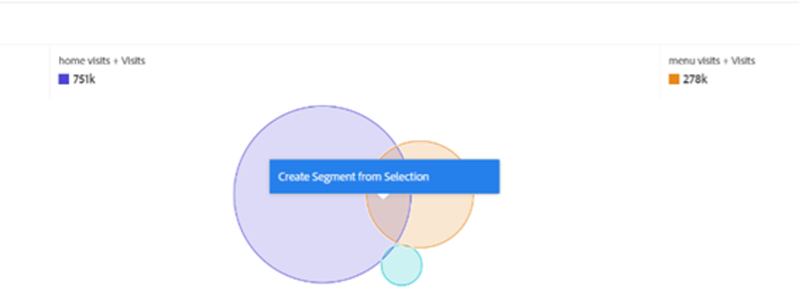
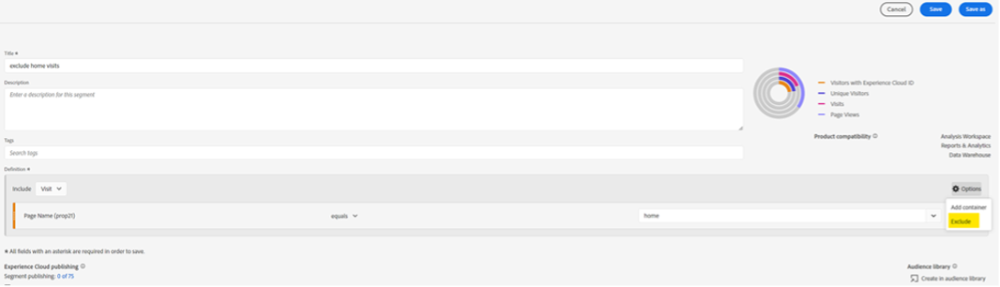
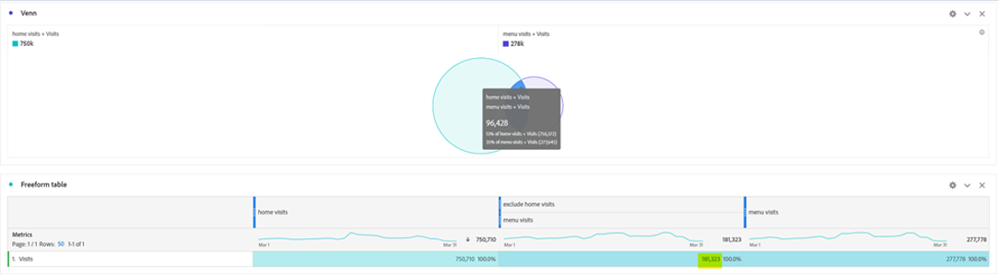
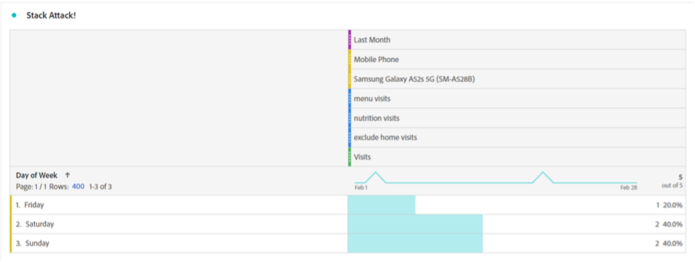
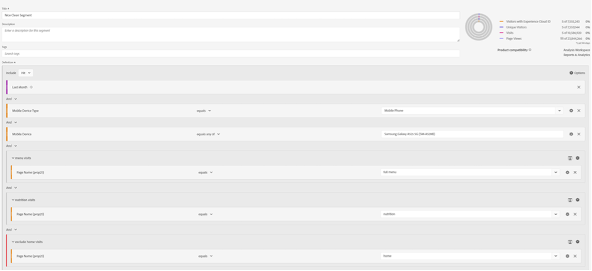
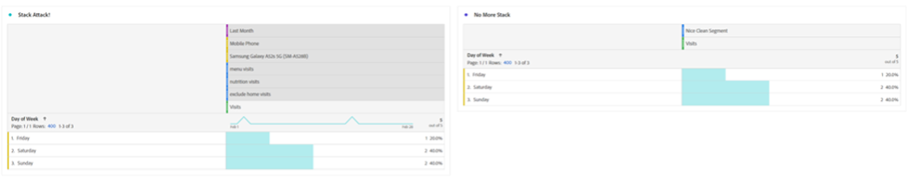
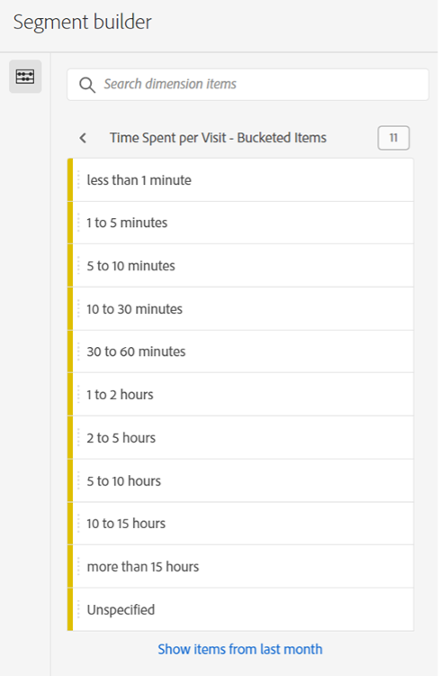
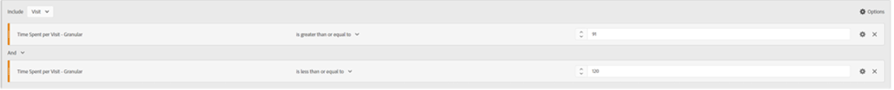

# Warten Sie jetzt einfach auf ein Segment… Verwenden Sie Segmente, um neue Einblicke in Analysis Workspace zu erhalten

Egal, ob Sie ein neuer Adobe Analytics-Anwender oder ein erfahrener Profi sind, Sie werden Segmente in Ihren Analysis Workspace-Projekten recht häufig nutzen. Wie [Adobe Experience League](https://experienceleague.adobe.com/docs/analytics/components/segmentation/seg-overview.html?lang=de) beschreibt, „können Sie mit Segmenten Untergruppen von Besuchern anhand von Merkmalen oder Website-Interaktionen identifizieren.“ Während das grundlegende Ergebnis dieser Funktion die Isolierung von Benutzergruppen, Besuchen oder Treffern auf Ihrer Site bedeutet, kann ein scharfsinniger Analyst wie Sie mit diesem Tool kreativ werden und neue Wege finden, um Einblicke in Ihre Site-Aktivität zu erhalten. Die Liste der möglichen Optionen ist umfangreich. Zögern Sie nicht, eine eigene zu erstellen und sie für andere Personen in Ihrem Unternehmen oder online in Communities wie der [Adobe Analytics Community](https://experienceleaguecommunities.adobe.com/t5/adobe-analytics/ct-p/adobe-analytics-community?lang=de) auf Experience League oder der [#Measure Slack](https://www.measure.chat/) Community freizugeben.

Wenn Sie das Erstellen eines Segments schnell auffrischen müssen, lesen Sie die Experience League-Dokumentation zur Verwendung von [Segment Builder](https://experienceleague.adobe.com/docs/analytics/components/segmentation/segmentation-workflow/seg-build.html?lang=en) in Analysis Workspace.

## Vergleichen und Abgleichen von Segmenten

In Analysis Workspace können Sie zwei Segmente mithilfe von &quot;[Segmentvergleich“ ](https://experienceleague.adobe.com/docs/analytics/analyze/analysis-workspace/panels/segment-comparison/segment-comparison.html?lang=de). Einen Segmentvergleich finden Sie im Abschnitt Bedienfelder der linken Navigationsleiste:

Manchmal benötigen Sie jedoch kein vollständiges Vergleichsfenster, um Ihren Endbenutzern wichtige Erkenntnisse zu vermitteln. Glücklicherweise können einige Funktionen auch in einem Standard-Panel verglichen werden.

Die [Venn-Diagrammvisualisierung](https://experienceleague.adobe.com/docs/analytics/analyze/analysis-workspace/visualizations/venn.html?lang=de) kann Ihnen dabei helfen, einen schnellen Vergleich zu erstellen, sodass Sie den Mauszeiger über die sich überschneidenden Sitzungen, Bestellungen, Benutzer usw. bewegen und die sich überschneidenden Segmente sehen können, die zwischen zwei bis drei benutzerdefinierten Segmenten vorhanden sind. Sie können auch schnell Segmente erstellen, indem Sie mit der rechten Maustaste auf einen der überlappenden Abschnitte klicken:

Manchmal sind die wichtigen Informationen nicht in den sich überschneidenden Daten enthalten, sondern die Daten, die sich nicht überschneiden. Eine schnelle Möglichkeit, dies anzuzeigen, besteht darin, eine Kopie eines Segments zu erstellen und es zu einem „Ausschließen“-Segment zu machen:

Indem Sie Ihr „Ausschließen“-Segment mit dem anderen Segment in Ihrem Vergleich stapeln, können Sie jetzt schnell berechnen, wie viele Besuche Ihre Menüseite erreichen, ohne auch die Startseite in derselben Sitzung anzuzeigen:

## Stack-Angriff

Ebenso können Sie die sich überschneidenden Daten eines Venn-Diagramms erstellen, indem Sie einfach beliebige Segmente stapeln. Die Anzahl der Segmente oder einzelnen Dimensionen, die Sie stapeln, ist unbegrenzt. Wenn ich zum Beispiel schnell herausfinden wollte, an welchen Wochentagen meine Website im letzten Monat ein Mobiltelefon besucht hat, insbesondere ein Samsung Galaxy A52, das meine Speisekarten- und Ernährungsseiten gesehen hat, aber meine Startseite NICHT gesehen hat, kann ich sie schnell so erstellen:

Aber noch besser: Sobald ich die perfekte Untergruppe meines Benutzers oder meiner Besucherbasis gefunden habe, kann ich all diese Werte auswählen, mit der rechten Maustaste klicken und sofort ein Segment erstellen:

Das ist eine Menge Macht in einem Segment.

## Ein Zahlensegment für mehrere Segmente

Viele Benutzende betrachten beim Erstellen von Segmenten häufig Nominal-, Ordinal- oder Intervallwerte - Dinge wie eine besuchte Seite, einen Altersbereich von Benutzenden oder die Anzahl der Besuche, die eine Benutzerin oder ein Benutzer in der Vergangenheit gemacht hat. Sie können jedoch auch Verhältnisdaten beim Erstellen eines Segments verwenden, indem Sie diese Werte zu Buckets zusammenfassen - egal, ob es sich um Standarddimensionen, Standardmetriken oder benutzerdefinierte Variablen und Metriken für Ihre Organisation handelt.

Beispielsweise stehen für „Zeit auf Seite“ oder „Zeit pro Besuch“ vordefinierte Buckets zur Verfügung:

Diese entsprechen jedoch möglicherweise nicht immer den Anforderungen Ihres Unternehmens - vielleicht laufen die meisten Besuche auf der Website unter 10 Minuten. Sie können granulare Messungen verwenden, um Behälter unterschiedlicher Größe zu erstellen. Im Folgenden finden Sie eine erstellte Ansicht über Besuche, die zwischen 1 Minute, 1 Sekunde und 1 Minute bzw. 30 Sekunden dauern:

Nach der Erstellung kann ich jetzt meine Besuche, Bestellungen und andere Ereignisse nach den verschiedenen von mir angepassten Zeitgruppen anzeigen:

Sie können sogar mit der Untersuchung beginnen, wie sich Ihre Key Performance Indicators (KPIs) ändern, und zwar als Faktor dafür, wie viel Zeit ein Benutzer aufwendet, wie viele Seiten er bei einem Besuch aufruft, wie oft er in der Vergangenheit besucht hat oder einen anderen numerischen Wert. Dies ermöglicht es Ihnen, eine Metrik als Faktor einer anderen Metrik anzusehen:

Die Möglichkeiten, Segmente zu nutzen, um neue Einblicke zu finden, sind unbegrenzt! Dies ist lediglich ein Ausgangspunkt. Probieren Sie selbst einige Beispiele aus und teilen Sie der Community mit, was Sie entdecken: [Adobe Analytics Community](https://experienceleaguecommunities.adobe.com/t5/adobe-analytics/ct-p/adobe-analytics-community?lang=de) auf Experience League oder die [#Measure Slack](https://www.measure.chat/) Community.

Frohes Segmentieren!

## Autor

Dieses Dokument wurde verfasst von:

**Dan Cummings**, Sr. Product Engineering Analytics Manager bei McDonald&#39;s Corporation

Adobe Analytics-Experte
