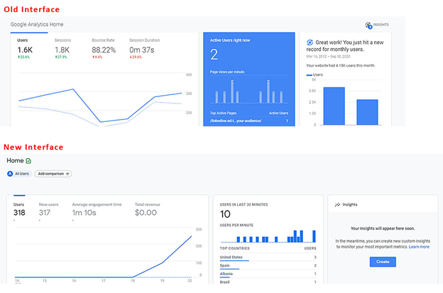

# Ein ausführliches Handbuch für den Umstieg von Google Analytics auf Adobe Analytics

## 1. Einführung

Eine der größten Herausforderungen bei der Umstellung von einem Tool auf ein anderes besteht darin, zu lernen, wo die entsprechenden Funktionen zu finden sind und wie man sie effizient nutzt. Diese Ausführungen sind Teil einer umfangreicheren Anleitung, die Benutzern den Umstieg auf Adobe Analytics erleichtern soll (entweder als neuer Benutzer oder als jemand, der zuvor Google Analytics verwendet hat). Ein ausführlicher Vergleich mit GA, dem wahrscheinlich bekanntesten Vergleichs-Tool, wird den Benutzern helfen, ihr vorhandenes Wissen auf das neue Toolset anzuwenden. Auch wenn diese Erläuterung die praktische Erfahrung nicht ersetzen kann, wird sie Ihnen den Einstieg erleichtern und hoffentlich die Probleme beseitigen, auf die Sie während dieser Zeit stoßen werden (oder sogar zur Auffrischung dienen, nachdem Sie sich mit dem neuen Tool schon etwas vertraut gemacht haben).

Lassen Sie uns kurz die Terminologie vergleichen:

| **Beschreibung** | **Adobe Analytics** | **Google Analytics** |
|--------------------------------------------------------------------------------------------------------------------------------|---------------------|----------------------|
| Eine Ereignismetrik, die anzeigt, dass eine Seite (oder ein Bildschirm in einer Mobile App) angesehen wurde | Seitenansicht | Seitenansicht. |
| Eine Metrik, die eine Reihe von Interaktionen auf Ihrer Website oder Mobile App darstellt, welche im gleichen Zeitrahmen stattfinden | Besuch | Sitzung |
| Eine Metrik, die ein identifiziertes Gerät definiert (basierend auf mehreren Kriterien, einschließlich Cookies und anderen Verhaltensmustern, um Benutzerinformationen zu vereinen) | Unique Visitor | Benutzer |

## 2. Die Benutzeroberfläche

Wenn ich Adobe Analytics mit Google Analytics vergleiche, stelle ich immer wieder fest, dass sich in der Adobe-Benutzeroberfläche sehr viel abspielt – das wirkt auf viele abschreckend. Das stimmt, es ist aber – ob Sie es glauben oder nicht – eine Stärke und keine Schwäche. Adobe bietet eine breite Palette von Werkzeugen und große Flexibilität bei der Datenvisualisierung, sodass Sie viel mehr Freiheit in der visuellen Darstellung haben.

Beginnen wir mit dem „In-Site“-Reporting.

### 2.1. In-Site-Reporting

#### 2.1.1. Startbildschirm

Sowohl Adobe Analytics als auch Google Analytics bieten die Möglichkeit, die erste Ansicht, die ein Benutzer bei der Anmeldung sieht, anzupassen.

##### 2.1.1.1. Workspace / Benutzerdefinierter Startbildschirm (Adobe Analytics)

Adobe Analytics erstellt keinen vorgefertigten Bericht, der allen Benutzern bei der Anmeldung präsentiert wird. Die standardmäßige Startseite bringt den Benutzer zum Startbildschirm für Workspace, der jedem Benutzer alle Workspace-Berichte anzeigt, die er erstellt hat oder die für ihn freigegeben wurden. Außerdem hat jeder Benutzer die Möglichkeit, einen beliebigen dieser Berichte als Startbildschirm festzulegen, wenn er dies wünscht.

Weitere Einzelheiten zu Workspace werden später in diesem Handbuch erläutert. Siehe Abschnitt 2.1.2.1

>[!TIP]
>
>Erstellen/Teilen Sie einige Standardberichte für Ihre Organisation, damit die Benutzer einen Ausgangspunkt haben, um Informationen zu sehen, ohne gleich ihre eigenen Berichte erstellen zu müssen.

##### 2.1.1.2. Startbildschirm-Insights (Google Analytics)

* Der Google Analytics-Startbildschirm bietet Ihnen einige vordefinierte Visualisierungen.  Diese umfassen u. a. Folgendes:
* Benutzer, Sitzungen, Absprungrate und Sitzungsdauer in den letzten 7 Tagen
* Benutzer nach Tageszeit in den letzten 30 Tagen
* Aktuelle Benutzer und die aktivsten Seiten
* Traffic-Kanal, Quelle/Medium und Empfehlungen in den letzten 7 Tagen
* Sitzungen nach Land in den letzten 7 Tagen
* Top-Seiten der letzten 7 Tage
* Trend der aktiven Benutzer für die letzten 30 Tage
* und vieles mehr

In GA4 haben die Benutzer mehr Möglichkeiten, den Startbildschirm anzupassen und ihre eigenen Berichte hinzuzufügen.

Dies ist wahrscheinlich das, was Sie am meisten vermissen werden, wenn Sie zu Adobe wechseln. Es gibt keinen vorgefertigten Startbildschirm, aber Sie können ganz einfach einen benutzerdefinierten Arbeitsbereich einrichten. Erstellen Sie dazu diejenigen der oben genannten Berichte, die Sie benötigen. Andernfalls können Sie diesen Arbeitsbereich auch als Ihren Startbildschirm festlegen. Mehr dazu später (oder siehe Abschnitt 2.1.2.1 Adobe Workspace).

#### 2.1.2. In-Site-Berichterstellung

Zusätzlich zu den einfachen Berichten, die die Analyse-Tools bereitstellten, bietet jedes Tool auch leistungsfähigere Tools, mit denen Sie Ihre eigenen benutzerdefinierten Berichte erstellen können.

##### 2.1.2.1. Adobe Analytics Workspace

Dies ist das Kraftzentrale von Adobe Analytics. Seit seiner Einführung im Jahr 2017 ist es die erste Anlaufstelle für Analytics-Analysen und der Hauptgrund dafür, dass der Bereich „Berichte“ demnächst eingestellt wird.

Mit diesem Tool können Sie Berichte mit umfassender Freiheit erstellen.

Der Bericht kann in Bereiche unterteilt werden, die eine beliebige Anzahl von Visualisierungen enthalten können. Die Bereiche können auf allgemeine Informationen wie Datumsbereiche und allgemeine Segmentfilter eingestellt werden.

Sowohl die Bereiche als auch die darin enthaltenen Visualisierungen können in der Größe verändert und verschoben werden, um Elemente nebeneinander oder übereinander anzuzeigen. Wenn Sie also zwei verschiedene Datenreihen nebeneinander vergleichen möchten, können Sie Bereiche erstellen, die in der Mitte 50/50 geteilt sind und die beiden Sites nebeneinander zeigen, um einen einfachen Vergleich zu ermöglichen.

Benutzern steht eine Vielzahl von Visualisierungen zur Verfügung:

* Freiformtabelle
* Kohortentabelle
* Fallout
* Fluss
* Diagramme
   * Fläche (gestapelt und ungestapelt)
   * Linie
   * Streuung
   * Balken (gestapelt und ungestapelt)
   * Horizontales Säulendiagramm
   * Ringdiagramm
   * Histogramm
   * Horizontaler Balken (gestapelt und ungestapelt)
* Zuordnung
* Zusammenfassende Blöcke
   * Zusammenfassende Änderung
   * Zusammenfassender Text
   * Text (freies Textfeld zur Eingabe zusätzlicher Informationen, um den Kontext zu verdeutlichen)
* Venn

Jeder Bereich und jede Visualisierung kann betitelt und mit einer Beschreibung versehen werden, um den Kontext der angezeigten Informationen zu verdeutlichen.
In Adobe können Segmente (im Wesentlichen Filter für Daten) rückwirkend angewendet werden, und diese können in Spalten Ihrer Freiformtabellen übernommen werden, um Daten Seite an Seite zu vergleichen. Wenn ein Benutzer beispielsweise zwei verschiedene Kategorien auf seiner Website hinsichtlich der Besucherzahlen vergleichen möchte, kann er ein Segment für „Kategorie A“ und ein anderes Segment für „Kategorie B“ erstellen.

Freiformtabellen ermöglichen mehrere Spalten und eine beliebige Segmentierung, um Daten nach Wunsch darzustellen.

Sie möchten keine Aufschlüsselung nach Datum sehen? Ziehen Sie einfach eine andere Dimension oder ein anderes Segment in den Arbeitsbereich, um die Daten auf andere Art darzustellen, z. B. indem Sie Segmente für den Gerätetyp verwenden, und fügen Sie dann eine Aufschlüsselung nach Betriebssystem für Ihre Handy-/Tablet-Benutzer hinzu:

Mit Workspace können Sie Ihrer Kreativität freien Lauf lassen, Sie sind nicht auf Standard-Aufschlüsselungen beschränkt. Sie können die Visualisierungen erstellen, die Sie benötigen, um aufschlussreiche Vergleiche auszuführen.

>[!TIP]
>
>Scheuen Sie sich nicht, mit den Möglichkeiten zu spielen und Verschiedenes auszuprobieren. Es gibt hier so viele Möglichkeiten, außergewöhnliche Ergebnisse zu erzielen! Prüfen Sie aber auch, ob das Ergebnis tatsächlich Ihrem beabsichtigtem Ziel entspricht. Erfahrung ist hier sicherlich sehr hilfreich!

Sie können sogar spontan berechnete Metriken oder Segmente erstellen, die nur in einem Bericht vorhanden sind (um zu verhindern, dass Ihr Segment- und Berechnungsspeicher überfüllt wird). Damit können Sie auch gezielt Elemente erstellen, die für bestimmte Berichte benötigt werden, ohne Ihre Organisation mit Dingen zu überfordern, die in anderen Kontexten nicht brauchbar sind.

Diese Erläuterung dient nur zur Einführung in dieses Tool. Es gibt noch weitere, detailliertere Anleitungen, um Ihnen den Einstieg zu erleichtern. Danach sind Sie in der Lage, umfassende Berichte zu erstellen, wie zum Beispiel:

Es sollte auch beachtet werden, dass Arbeitsbereiche nicht automatisch gespeichert werden, weshalb es einfacher ist, einen einmaligen Ad-hoc-Bericht zu erstellen, ohne den Berichtsspeicher zu verstopfen.

Ein weiteres leistungsstarkes Merkmal von Arbeitsbereichen ist die Möglichkeit, interaktive Modifikatoren in Form von Dropdown-Menüs auf Ihre Berichte anzuwenden. Diese Dropdown-Menüs funktionieren zwar nicht bei exportierten CSV- oder PDF-Dateien Ihrer Berichte, aber innerhalb des Live-Berichts können Sie damit alle Visualisierungen in einem Bereich aktualisieren, um denselben Bericht unter verschiedenen Bedingungen anzuzeigen. Es können mehrere Dropdown-Menüs verwendet werden. Solange sich die Optionen nicht gegenseitig ausschließen, werden die ausgewählten Elemente gestapelt, um eine übersichtliche Darstellung der Informationen zu ermöglichen.

>[!IMPORTANT]
>
>Weitere Informationen über die Verwendung von Dropdown-Menüs und Freiform-Aufgliederungen finden Sie unter <https://experienceleaguecommunities.adobe.com/t5/adobe-analytics-discussions/the-power-of-dropdown-filters-and-dimension-breakdowns-in-adobe/td-p/434680>

##### 2.1.2.2. Google Analytics: Dashboards, benutzerdefinierte Berichte und gespeicherte Berichte

Google verfügt über einige Tools zur Erstellung von Berichten innerhalb der Benutzeroberfläche, die jedoch die gleiche Darstellung und die gleichen Einschränkungen wie der Bereich mit den Berichten aufweisen.

Wer sich mit Google Analytics auskennt, wird sich jetzt vielleicht fragen, ob Google Data Studio nicht ein besseres Äquivalent zu Adobes Workspace ist. Das ist richtig, aber da Data Studio technisch gesehen kein Teil des Analytics-Tools ist und Verbindungen zu verschiedenen Datenquellen ermöglicht, wird dieses Tool später im Abschnitt „Erweiterter Zugriff auf Berichte“ dieser Ausführungen behandelt (insbesondere in Abschnitt 2.2.3).

Google-Dashboards und benutzerdefinierte Berichte ermöglichen es Ihnen, mehrere Visualisierungen in einem Bericht zusammenzufassen. Im Gegensatz zu Workspace sind Sie aber immer noch auf einfache Korrelationen beschränkt und können nicht festlegen, welche Daten in welche Spalten eingefügt werden können.

Bei benutzerdefinierten Berichten besteht eine der größten Herausforderungen darin, dass ein Filter, den Sie erstellen, für alle Registerkarten des Berichts gilt... Es gibt keine Möglichkeit, zwei verschiedene Filter innerhalb desselben Berichts zu vergleichen.

Für oberflächliche Vergleiche ist dies ausreichend. All diese Funktionen ähneln denen der älteren Dashboards, benutzerdefinierten Berichten und Lesezeichen von Adobe. Grundlegende Tools zur Erfüllung Ihrer Anforderungen, die in der Report Suite enthalten sind.

#### 2.1.3. Berichte

Sowohl Google als auch Adobe verfügen über einige navigierbare Berichte, bei denen es sich um vorgefertigte Tabellen und einfache Zeitreihendiagramme handelt, die auf einer Dimension basieren.

##### 2.1.3.1. Adobe Analytics-Berichte

Adobe Analytics verfügt ebenfalls über einen Bereich namens „Berichte“, der jedoch im Wesentlichen durch Analysis Workspace ersetzt wird (und in der Tat wurde das Ende dieser Schnittstelle angekündigt, da Workspace ein viel leistungsfähigeres Tool ist, siehe [Abschnitt 2.1.2.1]), in dem die meisten dieser Tabellen einfacher erstellt und geändert werden können. Bei Adobe sind die Abschnitte viel stärker untergliedert, was entmutigend wirken kann:

Da die meisten der oben genannten Punkte über Workspace zugänglich sind, werde ich einen kurzen Überblick über diese Abschnitte und ihre Beziehung zu Google Analytics geben und die Berichte hervorheben, die hier noch relevant sind.

Sie würden Website-Metriken erwarten. Sie umfassen die Standardmetriken (Seitenaufrufe, Unique Visitors, Besuche sowie benutzerdefinierte Ereignisse, die Sie eingerichtet haben). Dieser Bericht ähnelt dem Verhaltensbericht in GA, enthält aber auch einige der Informationen, die Sie unter „Zielgruppe“ finden würden (da Adobe die verschiedenen Metriktypen nicht aufteilt).

Hier finden Sie auch „Bot“-Berichte. Traffic von Bots ist zwar von allen Standardberichten ausgeschlossen, es gibt aber zwei Berichte, die Ihnen einen Einblick geben, was passiert und welche Bots auf Ihre Website kommen. Dies ist besonders nützlich, wenn Sie benutzerdefinierte Bot-Regeln eingerichtet haben, um bekannte Spam-Bots auszuschließen, die häufig Ihre Website besuchen. So erhalten Sie einen Einblick in die Aktivitäten dieser Bots, ohne dass Ihre Hauptberichte mit deren Traffic überflutet werden. Bot-Berichte sind derzeit über Workspace nicht verfügbar (mit neuen Berichtsfunktionen, die in Kürze eingeführt werden, können Benutzer aber diese Informationen auch dort erhalten).

„Site-Content“ ist eine Gruppierung von Adobe-Standarddimensionen: Seitenname, Site-Bereiche (Kanäle), Hierarchien (eine Möglichkeit, benutzerdefinierte Aufschlüsselungsberichte über die Organisation innerhalb Ihrer Website zu erstellen), Server (dies ist besonders hilfreich, wenn Sie mehrere Subdomains auf Ihrer Website haben oder mehrere Websites in einer Tracking-Suite zusammenfassen) usw. Alle diese Funktionen sind in Workspace verfügbar.

„Mobile“ ist eine Gruppierung von Daten, die sich auf Mobilgeräte beziehen, wie Geräte, Gerätetypen usw. Alle diese Funktionen sind in Workspace verfügbar.

„Pfade“ ist ein weiteres Element, das in Workspace nicht wirklich verfügbar ist. In Workspace gibt es zwar ein Flussdiagramm, aber Sie können nur die Eingangs- und Ausgangsflüsse für eine einzelne Seite/einen einzelnen Wert sehen, während Sie mit „Pfade“ die am häufigsten verwendeten Pfade auf Ihrer Website sehen können. Standardmäßig ist „Seiten“ der erste Pfadbericht, der für Sie eingerichtet wird, Sie können dies aber für benutzerdefinierte Eigenschaften aktivieren (wenn Sie z. B. einen Wert für „Seitentyp“ nachverfolgen, können Sie sich die Pfade innerhalb der Seitentypen ansehen). Ein weiterer Punkt, der mir persönlich an der Funktion „Pfade“ gefällt, ist die einfache Art und Weise, in der die Informationen präsentiert werden... Das Flussdiagramm in Workspace kann (abhängig von der angezeigten Datenmenge) schnell überwältigend werden. Ich empfehle, beide auszuprobieren... beide haben ihren Nutzen und Wert, je nachdem, was Sie erreichen wollen. Es sollte beachtet werden, dass für „Flüsse“ jede Dimension verwendet werden kann, während die Pfadbestimmung in einer Prop in der Verwaltungskonsole eingerichtet werden muss.

Die Berichte über Traffic-Quellen, Kampagnen und Marketing-Kanäle ähneln alle dem Akquisebericht in Google. Der Bericht über Traffic-Quellen konzentriert sich auf die tatsächlichen Referrer, der Bericht über Kampagnen konzentriert sich auf Ihre Kampagnen-Codes und der Bericht über Marketing-Kanäle konzentriert sich ebenfalls auf Kampagnen-Codes, wendet aber zusätzlich eine von Ihnen festgelegte Logik an, wie die Informationen zu verarbeiten sind. Ich finde, dass Adobe viel mehr Freiheiten bei der Einrichtung Ihrer Regeln bietet, während Google vieles für Sie übernimmt, sodass dies eine gewisse Umstellung in der Denkweise erfordert. Es sollte auch beachtet werden, dass die Attribution von Kampagnen-Codes bei Google standardmäßig 6 Monate beträgt, während sie bei Adobe standardmäßig auf 1 Woche eingestellt ist. Sie können dies zwar in Ihren Admin-Einstellungen ändern, aber in Workspace können Sie tatsächlich eine benutzerdefinierte Attribution auf jede Dimension anwenden, was Ihnen viel mehr spontanen Spielraum bietet.

Die Berichte zur Besucherbindung und zum Besucherprofil ähneln den Zielgruppenberichten in Google Analytics. Die Besucherbindung konzentriert sich eher auf die Häufigkeit der Wiederkehr, während das Besucherprofil eher auf die Geografie und Technologie der Nutzer ausgerichtet ist.

„Benutzerspezifische Konversion“ und „Benutzerspezifischer Traffic“ sind jeweils Berichte mit benutzerdefinierten Dimensionen. Konversionen sind Ihre eVars (bei denen Sie einen benutzerdefinierten Ablauf für den Wert festlegen können – z. B. Treffer, Besuch, Monat, Jahr usw. – und dieser Wert bleibt für diesen Benutzer für den angegebenen Zeitraum erhalten, sofern er nicht überschrieben wird). Traffic-Variablen sind Ihre Props, aber Sie können diese auch für Pfadsetzungsberichte oder als Listenelemente einrichten (wobei Mehrfachwerte auf der Grundlage eines von Ihnen gewählten Trennzeichens aufgespaltet werden).

„Medien“ ist z. B. für Videos oder Audiodateien, für die Sie ein spezielles Medien-Tracking eingerichtet haben.

„Benutzerdefinierte Berichte“ ist ein Bereich, in dem ein Benutzer die Spalten und Aufschlüsselungen, die er innerhalb der Berichtsschnittstelle erstellt hat, anpassen und als benutzerdefinierten Bericht speichern kann. Da Workspace jedoch, wie bereits erwähnt, so viel leistungsfähigere Aufschlüsselungen und Korrelationen ermöglicht, sollten alle benutzerdefinierten Anpassungen nur dort vorgenommen werden. Dies war eine gute Lösung, bevor es Workspace gab.

Der Abschnitt „Lesezeichen“ ähnelt den benutzerdefinierten Berichten, wo häufig verwendete Berichte in der Berichtsschnittstelle mit Lesezeichen versehen werden können, damit sie leichter gefunden werden können.

Dashboard war ein älteres Produkt, das es ermöglichte, Reportlets von Daten in einer Visualisierung zu kombinieren. Die Funktionalität in Workspace (Abschnitt 2.1.2.1) ist jedoch so viel einfacher zu handhaben, dass es nur noch als Zugangspunkt zu alten Berichten existiert, die neu erstellt werden sollten, bevor diese Funktion eingestellt wird.

„Ziele“ ist ein spezieller Berichtsbereich, der es ermöglicht, einen Bericht auf der Grundlage eines Ziels innerhalb eines bestimmten Zeitraums zu erstellen, sodass Teams beispielsweise Kampagnen überwachen und sehen können, ob sie auf dem richtigen Weg sind, ihre Traffic-Ziele zu erreichen.

Alle Berichte in diesem Bereich können nach mehreren metrischen Spalten und Dimensionen aufgeschlüsselt werden. Die Einfachheit der Visualisierungen und die Logik, die sich hinter den möglichen Korrelationen verbirgt, konnte jedoch manchmal frustrierend sein.

##### 2.1.3.2. Google Analytics-Berichte

Google Analytics unterteilt diese Berichte in die folgenden Abschnitte: Echtzeit, Zielgruppe, Akquise, Verhalten und Gespräche (in GA3) und in Lebenszyklus (mit den Unterabschnitten Akquise, Interaktion, Monetarisierung, Kundenbindung) und Benutzer (mit den Unterabschnitten Demografie und Technik).

Sie können diese Visualisierungen geringfügig anpassen, eine sekundäre Dimensionsaufschlüsselung hinzufügen, die Visualisierung ändern, einen Filter für die Daten erstellen usw. Sie können Ihre Anpassungen als gespeicherten Bericht speichern.

So erhalten Sie schnell und einfach Erkenntnisse aus Ihren Daten. Sie können jedoch nicht Dinge wie Benutzer mit Seitenaufrufen für eine Seite in derselben Tabelle vergleichen und Sie können nicht mehr als eine zusätzliche Dimension hinzufügen, um zusätzliche Daten zu sehen.

Diese Berichte eignen sich gut für die schnelle Analyse von Daten, aber wenn Sie wirklich in die Tiefe gehen müssen, stellen diese Einschränkungen ein Problem dar.

### 2.2. Erweiterter Zugriff auf Berichte

Zusätzlich zum „In-Site-Reporting“ bieten die meisten Tools erweiterte Funktionen, die es Ihnen ermöglichen, Ihre Analyse außerhalb der Tools durchzuführen und etwas Individuelleres zu erstellen.

#### 2.2.1. Adobe Analytics Report Builder (Microsoft Excel-Erweiterung)

Workspace ist ein großartiges Tool, aber manchmal müssen Sie Ihre Daten in eine benutzerdefinierte Kalkulationstabelle übertragen, möglicherweise mit dem Ziel, mehrere Datenquellen miteinander zu verknüpfen. An dieser Stelle kommt Report Builder ins Spiel.

Report Builder ist ein Plug-in für Microsoft Excel, mit dem Sie Verbindungen zu Ihren Adobe Analytics-Daten erstellen können, um tabellarische Daten zu erhalten, die Sie in Excel bearbeiten können. Um dies effizient zu nutzen, würden Sie in der Regel die Daten in einige Rohdaten-Registerkarten einlesen und dann Zellverweise in Excel verwenden, um die Daten aus diesen Registerkarten in einen einzigen konsolidierten Bericht einzulesen und dann Diagramme und Visualisierungen zu erstellen.

>[!NOTE]
>
>Report Builder verfügt über eine spezielle Zugriffsberechtigung, die auf Ihre Benutzer angewendet werden muss, damit sie auf dieses Plug-in zugreifen können. Diese Berechtigung sollte wahrscheinlich nur Benutzern erteilt werden, die gelernt haben, wie man das Tool richtig benutzt.

#### 2.2.2. Adobe Analytics-API-Verbindung

Wenn Sie Ihre Adobe Analytics-Daten mit etwas anderem als Excel verarbeiten möchten, aber dennoch die Vorteile der verarbeiteten Daten (einschließlich der Bot-Regel-Ausschlüsse) nutzen möchten, können Sie die API von Adobe verwenden, um die Daten direkt abzurufen und sie dann über ein Skript zu verarbeiten oder sie in eine Datenbank zur Verwendung mit einem anderen System einzufügen.

Es sollte beachtet werden, dass die API nach wie vor Korrelationsdaten abruft, wobei die in der Abrufanfrage angegebenen Aufschlüsselungen und Segmente angewendet werden.

Workspace von Adobe (Abschnitt 2.1.2.1) verwendet die API, um alle Berichte zu erstellen, und wenn Sie in Workspace den Debug-Modus aktivieren, werden die verwendeten API-Aufrufe genau angezeigt. Auf diese Weise können Sie Ihre API-Aufrufe schnell erstellen, indem Sie mit Workspace die Daten erstellen und validieren, die Sie abrufen möchten, und dann diese API-Aufrufe verwenden, um die Daten an Ihre eigene Verarbeitung weiterzuleiten.

#### 2.2.3. Google Analytics Data Studio

Wenn Sie aufmerksam mitgelesen haben, wissen Sie bereits, dass ich Data Studio als Äquivalent zu Workspace von Adobe erwähnt habe. Mit Data Studio können Sie Google Analytics-Daten, aber auch Daten aus anderen Quellen einlesen. Das ist gut, wenn Sie Ihre Analysedaten mit anderen gesammelten Daten konsolidieren möchten. Wenn es aber um Google Analytics geht, habe ich die gleichen Einschränkungen bei der Visualisierung festgestellt, die auch in Google Analytics vorhanden sind. Die Art und Weise, wie die Zeilen und Spalten gebildet werden, schränkt die Möglichkeiten immer noch stark ein.

Es ist immer noch ein leistungsfähiges Tool und ich würde niemanden davon abraten, es zu verwenden. Meine persönliche Erfahrung ist jedoch, dass ich, nachdem ich Workspace so lange benutzt habe, dieses starre Verhalten ziemlich einschränkend finde.

#### 2.2.4. Google Tabellen-Erweiterung

Für meine eigenen Zwecke, wenn ich erweiterte Daten von Google Analytics abrufen muss, ist mein persönliches Tool der Wahl die Google Tabellen-Erweiterung. Natürlich muss ich mehrere Verbindungen zu meinen GA-Tabellen herstellen, aber ähnlich wie bei Report Builder von Adobe kann ich die Zellen aus den Rohdaten referenzieren und die Berichte erstellen, die ich benötige, und sie dann mit den grafischen Funktionen von Google Tabellen visualisieren.

## 3. Exporte von Rohdaten

Für die Fälle, in denen Sie wirklich Rohdaten benötigen, bieten sowohl Adobe als auch Google die Möglichkeit, Informationen auf diese Weise abzurufen.

### 3.1. Adobe-Daten-Feed

In Abschnitt 2.2.2 habe ich erwähnt, dass die Adobe Analytics-API auf „verarbeitete Daten“ zurückgreift. Der Rohdaten-Feed ruft immer noch Daten ab, die durch die „Verarbeitungsregeln“ verarbeitet wurden, die im Admin-Bedienfeld eingerichtet wurden (stellen Sie sicher, dass Ihre Rohdaten verzögert werden, um sicherzustellen, dass alle diese Regeln abgeschlossen sind, wenn der Rohdaten-Feed abgerufen wird). Dise Rohdaten enthalten aber alle Daten, die überall sonst ausgeschlossen sind.

Das bedeutet, dass alle Ihre Bot-Ausschlüsse, intern gefilterten IP-Daten usw. in den Rohdaten-Feeds enthalten sind. Es gibt Flags zur Kennzeichnung dieser Daten, sodass Ihr Entwicklungs-Team beim Aufbau eines Data Lake eine Logik zur entsprechenden Verarbeitung dieser Daten erstellen kann.

Die Rohdaten-Feeds können so angepasst werden, dass alle Datenspalten oder nur bestimmte Spalten gesendet werden, wenn Sie einen spezifischeren Feed benötigen.

Die Feeds können direkt an FTP, SFTP, S3, etc. gesendet werden.

### 3.2. Google Big Query

Leider habe ich mit diesem Google-Tool noch keine Erfahrung, aber theoretisch sollte es ähnlich wie der Daten-Feed von Adobe funktionieren und Ihrem technischen Team den Zugriff auf Rohdaten aus Ihrem Google Analytics-Konto ermöglichen.

Ich glaube jedoch, dass es sich nicht um einen vollständigen Dump von Rohdaten handelt, sondern dass Ihre Techniker über SQL-Abfragen auf die Daten zugreifen können, sodass sie entweder gezielte Rohdaten oder, wenn sie möchten, alle Spalten der Rohdaten abrufen können, um sie in einen Data Lake aufzunehmen.

## 4. Schlussfolgerung

Wie bei jedem System braucht es etwas Übung, um sich damit vertraut zu machen. Ich hoffe aber, dass dieses Handbuch Ihnen den Einstieg erleichtert oder Ihnen Tipps gibt, um Ihre Nutzung von Adobe Analytics zu verbessern.

Ich möchte jedoch betonen, dass ich empfehlen würde, sowohl Adobe Analytics als auch Google Analytics in Ihrer Implementierungsstrategie zu verwenden (selbst wenn es nur die kostenlose Version von Google Analytics ist). Auf diese Weise haben Sie auch ein Backup-System, sodass immer Daten verfügbar sind, denn kein System ist unfehlbar.

Neben diesem Handbuch stehen Ihnen viele weitere Ressourcen zur Verfügung, mit denen Sie Ihre Strategie verbessern können:

* [Adobe Experience League](https://experienceleague.adobe.com/?lang=de#home) - mit Tutorials, Videos, Dokumentation und Community-Foren
* [Adobe-Benutzergruppen](https://analytics-augs.adobe.com/) - ein Treffpunkt für von der Community organisierte Events, die den Benutzern helfen, miteinander in Kontakt zu treten und ihre Implementierungen zu verbessern. Da diese jeweils in einer bestimmten Zeitzone stattfinden, sollten Sie auch nachsehen, was in anderen Regionen läuft.
* [YouTube-Kanal zu Adobe Analytics-Benutzergruppen](https://www.youtube.com/channel/UCQOHnCs7KZgsuFHVzwboQuA) - Konnten Sie keine Adobe Analytics-Benutzergruppensitzung erstellen? Sehen Sie sich frühere Benutzergruppensitzungen auf der ganzen Welt an, um mehr darüber zu erfahren, wie Ihre Kollegen das Tool verwenden.
* [Measure Chat Slack-Kanal](https://www.measure.chat/) - Treten Sie mit Adobe Analytics-Anwendern in der ganzen Welt in Kontakt und tauschen Sie Branchenkenntnisse aus, stellen Sie Fragen an Ihre Kollegen und schließen Sie sich Interessengruppen an.
* und vieles mehr!

## Autor

Dieses Dokument wurde verfasst von:

Jennifer Dungan, Optimization Manager Analytics bei Torstar

Adobe Analytics-Experte

