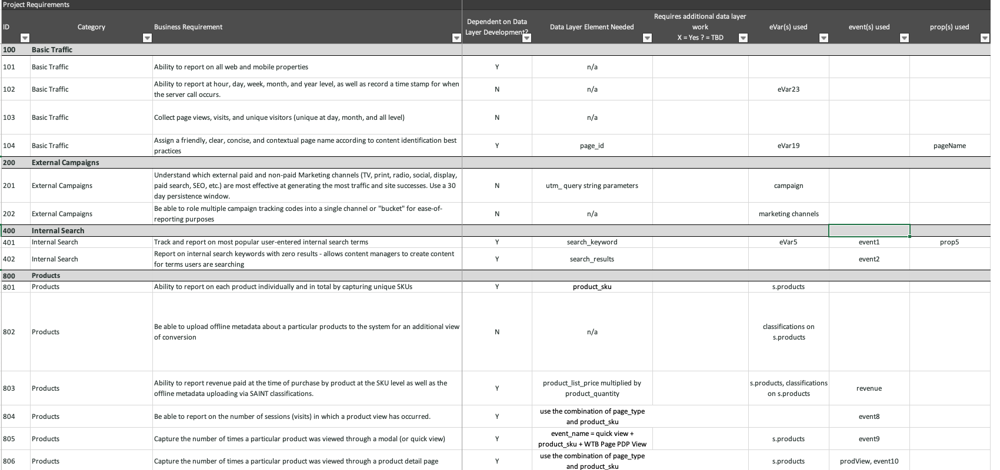

# Was ist Analytik? {#what-is-analytics}

Bevor Sie sich in die Inhalte von Adobe Analytics vertiefen, ist es hilfreich, die Antwort auf die grundlegende Frage zu verstehen: „Was ist Analytik?“ Analytik ist ein weit gefasster Begriff, der mehrere Disziplinen zur Förderung der Geschäftsentwicklung und -transformation umfasst, nämlich Geschäfts- und Datenanalytik. Es gibt einen Unterschied zwischen diesen beiden. Sehen wir uns das näher an.

## Die Rolle der Geschäftsanalytik

In den letzten Jahren hat sich die Nutzung des Internets für kommerzielle Zwecke explosionsartig entwickelt und damit auch die Menge an Daten, die Unternehmen darüber sammeln, wie Verbraucherinnen und Verbraucher mit ihrer Marke interagieren und sich mit ihr beschäftigen. Wenn Sie den Begriff „Big Data“ schon einmal gehört haben, fällt dieser in den Bereich der Geschäftsanalytik.

Die Geschäftsanalytik ist eine Komponente der Business Intelligence und konzentriert sich auf strategische Risiken und Chancen im großen Maßstab. Es handelt sich dabei um eine notwendige Fähigkeit, die Unternehmen besitzen müssen, um in ihrer Branche wettbewerbsfähig zu bleiben.

Es gibt vier Arten von Geschäftsanalytik:

* **Deskriptiv**: Dazu gehört die Verwendung historischer Daten zur Ermittlung von Trends in der Geschäftstätigkeit eines Unternehmens. Zum Beispiel muss ein Einzelhändler bereits vor der Hauptsaison oder der Urlaubssaison eine Vorhersage der Produktnachfrage treffen und benötigt einen optimalen Warenbestand, um seine Geschäftsziele zu erreichen.
* **Diagnose**: Was sind die Gründe für ein unerwartetes Ergebnis? Warum gab es in der Nebensaison eine derart große Nachfrage nach einem Produkt oder einer Dienstleistung? Die diagnostische Analyse ist eine tiefgründigere Form der deskriptiven Analyse und zielt darauf ab, aus den Daten Korrelationen abzuleiten.
* **Prädiktiv**: Hierbei werden historische Daten verwendet, um wahrscheinliche Ergebnisse oder Ereignisse zu ermitteln. Für genauere Prognosen werden häufig maschinelles Lernen (ML) und künstliche Intelligenz (KI) eingesetzt. Ein Beispiel für eine praktische Anwendung prädiktiver Analysen ist die Kundenabwanderung. Bei dieser Analyse werden Korrelationen ermittelt, um die Attribute von Kunden zu identifizieren, die möglicherweise abwandern. So können Sie Maßnahmen ergreifen, um eine solche Abwanderung zu verhindern.
* **Präskriptiv**: Hierbei handelt es sich um eine erweiterte Form der prädiktiven Analyse, die darauf abzielt, das gewünschte Ergebnis auf bestmögliche Art und Weise zu erreichen. Bei dieser Art von Analyse werden ebenfalls ML- und KI-Technologien.eingesetzt. Einzelhändler nutzen die präskriptive Analyse, um durch Änderungen in ihrer Geschäftstätigkeit die Margen zu verbessern.

## Die Rolle der Datenanalyse

Zur Datenanalyse werden viele der zur Geschäftsanalyse üblichen Technologien verwendet, sie ist jedoch umfassender angelegt und eher technischer Natur. Die Analyse von Big Data hängt beispielsweise von der Qualität und Organisation der Daten ab. Wie effektiv werden die Daten sortiert, gespeichert und bereinigt? Datenwissenschaftler arbeiten auf dem Gebiet der Datenanalyse. Sie transformieren riesige Datensätze, die dann von Wirtschaftsanalysten verwendet werden, um Informationen an das Unternehmen zu übermitteln und Prozesse und Metriken zu optimieren. Datenwissenschaftler untersuchen die Daten tiefgründiger und ermitteln Trends und Zusammenhänge.

## Wie passt Adobe Analytics dazu?

Adobe Analytics ist eine robuste Datenanalyseplattform, die kanalübergreifend Daten aus digitalen Erlebnissen erfasst, die die Customer Journey unterstützen, und Werkzeuge zur Datenanalyse bereitstellt. Es handelt sich dabei um eine Plattform, die häufig von Marketing-Fachleuten und Wirtschaftsanalysten für Geschäftsanalysen verwendet wird.

Geschäftsanforderungen, Daten-Design und Datenerfassung sind Schlüsselfaktoren für eine effektive Analysetätigkeit. Zunächst werden Daten zu wichtigen Customer Journeys und gewünschten Geschäftsergebnissen für herkömmliche digitale Erlebnisse wie Web und Mobilgeräte gesammelt. Die Daten sollten Antworten auf solche Fragen geben wie:

* „Welche Inhalte und Content-Typen sind bei Besuchern beliebt?“
* „Welche Pfade führen zu hochwertigen Konversionen wie Umsatz, Buchungen, Leads oder Abonnements?“
* „Welche Produkte, Services oder Inhalte sollte ich bekannten und unbekannten Besuchern zeigen?“
* „Wie gut funktionieren digitale Marketing-Kanäle?“

Sobald die Datengrundlage in Adobe Analytics erfasst wurde, verwenden Marketing-Fachleute und Wirtschaftsanalysten verschiedene Berichte und Datenvisualisierungswerkzeuge, die im Produkt verfügbar sind, um Analysen durchzuführen und aussagekräftige Erklärungsmuster für die Daten zu vermitteln. Darüber hinaus bietet Adobe Analytics verschiedene Formen der Ausgabe. Es könnte sich dabei um ein Segment oder eine Zielgruppe handeln, das bzw. die an ein Optimierungswerkzeug wie Adobe Target gesendet wird, um A/B-Tests durchzuführen. Es könnte sich um ein prädiktives Ergebnis handeln, das die Wahrscheinlichkeit einer Aktion einer Person angibt und von einem anderen System zur Modellierung verwendet wird.

Im Laufe der Zeit kommen in der Regel zu herkömmlichen Web- und Mobildaten andere Kanalquellen hinzu, darunter CRM, Callcenter, traditionelle Ladengeschäfte, Sprachassistenten und vieles mehr. Adobe Analytics bietet mehrere Möglichkeiten zur Erfassung von Daten aus praktisch jeder Kanalquelle, um eine solide Grundlage für Analysedaten zu schaffen.

Das Erfassen zusätzlicher Datensätze eröffnet die Möglichkeit, weiterentwickelte Arten der präskriptiven Datenanalyse durchzuführen, die maschinelles Lernen oder verbesserte Datenmodelle verwenden, wie Marketing-Attribution und Anomalieerkennung.

Wir empfehlen Ihnen, sich die Tutorials auf Experience League anzusehen, die Sie mit den wichtigsten Vorteilen und Funktionen von Adobe Analytics bekannt machen.
