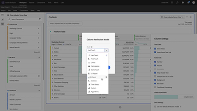
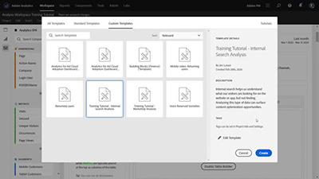

# Analytics-Tutorials

Holen Sie das Meiste aus [!DNL Adobe Analytics] heraus. Verwenden Sie diese Tutorials, um die Funktionen von Analytics kennenzulernen und die Vorteile für Ihr Unternehmen zu nutzen. Diese Inhalte sind für Administratoren, Datenanalysten, Marketing-Experten, Entwickler und Architekten geeignet.

Als ersten Schritt

* unten im Abschnitt **Neue Funktionen** über die neuesten Aktualisierungen und Funktionen.
* Die **Auswahl der Mitarbeiter** zeigt einige unserer Lieblingsinhalte
* Erkunden Sie den Inhalt sortiert nach Thema und Unterthema in der **linken Navigation**
* Verwenden Sie das Feld **Suche** oben auf der Seite, um einen konkreten Suchbegriff einzugeben.

Spezifische Lernangebote für verschiedene Rollen und Qualifikationen stehen ebenfalls im Abschnitt „Kurse“ zur Verfügung. Melden Sie sich einfach mit Ihrer Adobe ID an und navigieren Sie über die obere Navigationsleiste zu **Lernen > Empfohlene Kurse**.

## Auswahl der Mitarbeitenden

<table>
<tr>
  <td>
    
    

      <a href="analysis-workspace/attribution-iq/algorithmic-model-in-attribution-iq.md">
    <strong>Algorithmisches Modell in Attribution IQ</strong>
    </a>
    

    

    <em>Das algorithmische Zuordnungsmodell in Analysis Workspace verwendet statistische Verfahren, um für die ausgewählte Metrik die optimale Zuordnung dynamisch zu bestimmen.</em>
    

  </td>
   <td>
    
    

      <a href="analysis-workspace/navigating-workspace-projects/training-tutorial-template-in-analysis-workspace.md">
    <strong>Vorlage für Schulungs-Tutorials in Analysis Workspace</strong>
    </a>
    

    

    <em>Im Schulungs-Tutorial für Analysis Workspace machen Sie sich mit der gängigen Terminologie und den Schritten zum Erstellen Ihrer ersten Analyse in Workspace vertraut.</em>
    

  </td>
  <td>
    
    

      <a href="analysis-workspace/analysis-workspace-basics/analysis-workspace-overview.md">
    <strong>Übersicht über Analysis Workspace</strong>
    </a>
    

    

    <em>Allgemeiner Überblick über Analysis Workspace.</em>
    

  </td>
</tr>
</table>

## Weitere Ressourcen

[Dokumentation zu Adobe Analytics](https://experienceleague.adobe.com/docs/analytics.html?lang=de)
