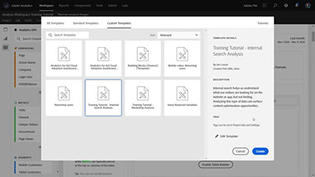

# Überblick

Willkommen auf der [!DNL Analytics] Tutorials.  Die Verwendung dieser Lernprogramme zusammen mit der [Dokumentation](https://docs.adobe.com/content/help/de-DE/analytics/landing/home.html) gibt Ihnen ein besseres Verständnis, wie Sie mit Adobe Analytics schneller als je zuvor Kundeneinblicke gewinnen können.  Als ersten Schritt
* Die neuesten Neuigkeiten finden Sie im Abschnitt **&quot;Neue Funktionen&quot;** unten
* **Personalauswahl** hebt einige unserer bevorzugten Inhalte hervor
* Inhalt nach Thema und Unterthema in der **linken Navigation**
* Verwenden Sie das **Suchfeld** oben auf der Seite, wenn Sie wissen, wonach Sie suchen

## Neuigkeiten

* **[Rechtsklick für Workspace-Effizienz (Video)](analysis-workspace/navigating-workspace-projects/right-click-for-workspace-efficiency.md)**

    
   *Erfahren Sie mehr über die beliebtesten Rechtsklicks in Analysis Workspace und deren Verwendung. From[!UICONTROL Freeform Tables]to[!UICONTROL Fallout Visualizations], right-clicking will make you more efficient and proficient in[!DNL Workspace].*

* **[Quick Insight-Bedienfeld in Analysis Workspace (Video)](analysis-workspace/using-panels/quick-insights-panel-in-analysis-workspace.md)**

    
   *Quick Insights bietet Nicht-Analytikern und neuen Benutzern von Analysis Workspace die Möglichkeit, betriebliche Fragen schnell und einfach zu beantworten.*

* **[Projektfreigabe in Analysis Workspace (Video)](analysis-workspace/curate-and-share-projects/project-sharing-in-analysis-workspace.md)**

    
   *Das Freigeben von Projekten ist eine Möglichkeit, Daten und Erkenntnisse aus Analysis Workspace für Benutzer in Ihrer Organisation zu demokratisieren. Sie können Empfänger je nach gewünschter Projekterfahrung in einer der drei Rollen platzieren – „Bearbeiten“, „Duplizieren“ und „Anzeigen“.*

## Personalauswahl

<table>
<tr>
  <td>
    
    

      <a href="analysis-workspace/attribution-iq/algorithmic-model-in-attribution-iq.md">
    <strong>Algorithmisches Modell in Attribution IQ</strong>
    </a>
    

    

    <em>Das algorithmische Zuordnungsmodell in Analysis Workspace verwendet statistische Verfahren, um für die ausgewählte Metrik die optimale Zuordnung dynamisch zu bestimmen.</em>
    

  </td>
   <td>
    
    

      <a href="analysis-workspace/navigating-workspace-projects/training-tutorial-template-in-analysis-workspace.md">
    <strong>Vorlage für Training-Tutorials in Analysis Workspace</strong>
    </a>
    

    

    <em>Das Analysis Workspace Training Tutorial erläutert die gängige Terminologie und die Schritte zum Aufbau der ersten Analyse in Workspace.</em>
    

  </td>
  <td>
    
    

      <a href="analysis-workspace/analysis-workspace-basics/analysis-workspace-overview.md">
    <strong>Analysis Workspace – Übersicht</strong>
    </a>
    

    

    <em>Überblick über Analysis Workspace.</em>
    

  </td>
</tr>
</table>
