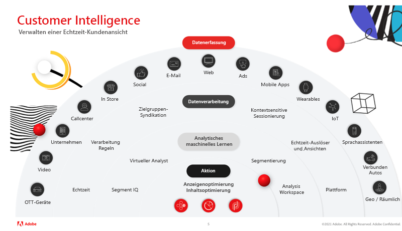

# Meistern der Kundenanalyse mit Virtual Analyst und Segment IQ in Adobe Analytics

In diesem Artikel erfahren Sie, wie wichtig die Verwendung von künstlicher Intelligenz und maschinellem Lernen (KI/ML) ist. Erfahren Sie als Nächstes mehr über die Vorteile und realen Erfolgsgeschichten globaler Kund*innen, die Virtual Analyst und Segment IQ verwenden, um Anomalien zu erkennen, Ausreißer zu vermeiden und den ROI zu maximieren.

## Der Wert künstlicher Intelligenz

Vielleicht erinnern Sie sich noch an die Zeit, als der Schachgroßmeister Garry Kasparov durch [!DNL Deep Blue] von IBM® besiegt wurde. Expert*innen waren bis dahin überzeugt, dass eine Maschine in einem so komplexen Spiel wie Schach die menschliche Entscheidungsfindung und das menschliche Urteilsvermögen nicht schlagen kann. Doch es wurde erreicht, und dies war der Schlüssel zu einem grundlegenden Wandel der Geschäftsstrategie und technologischen Innovation, indem die Macht der künstlichen Intelligenz entfacht wurde.

Adobe Analytics ist das Kernsystem der Intelligenz für das Erlebnisgeschäft und ermöglicht es allen im Unternehmen, die Interaktionen von Kund*innen mit ihrer Marke über alle Kontaktpunkte hinweg in Echtzeit und in großem Maßstab zu verstehen und zu optimieren.

Die KI-Tools von Adobe sind nicht dazu da, Sie zu ersetzen, sondern Ihnen zu ermöglichen, bei Ihren Bemühungen einen maximalen ROI zu erzielen.

## Transformieren Sie Ihre Analysen

Um Ihre Analysen weiterzuentwickeln, müssen wir uns auf drei wichtige Aspekte konzentrieren:

1. Organisation – wie Sie ganzheitliche Ansichten von Kunden schaffen, erkenntnisgesteuerte Entscheidungen priorisieren und Daten demokratisieren.

1. Technologie – wie Sie sicherstellen, dass Daten und Technologien maßstabsgetreu personalisiert sind.

1. Kund*innen – wie Sie Vertrauen aufbauen und sich an Veränderungen anpassen.

Analysen sind anspruchsvoll und zeitaufwändig. Dennoch besteht die ständige Notwendigkeit, die Zeit bis zur Erkenntnis zu verkürzen. Wichtigste Probleme für Organisationen:

* Eingeschränkte Organisationsressourcen – verschiedene Geschäftsziele können die Ressourcenverfügbarkeit einschränken
* Eingeschränktes technisches Know-how – die Frage, ob Wissen ausgetauscht und Daten demokratisiert werden können
* Kundenerwartungen– die Frage, ob Ihr Team dynamisch auf Verhaltensänderungen von Kund*innen reagieren kann

## Meistern Sie die Kundenanalyse mit Virtual Assistant, basierend auf Adobe Sensei

### 3 Stufen der Kundenanalyse

Wenn es um eine erfolgreiche Kundenanalysestrategie geht, müssen wir drei Ebenen durchlaufen (siehe Abbildung 1 oben): (a) Datenerfassung, (b) Datenverarbeitung, (c) Analyse und maschinelles Lernen. Erst dann können wir handeln und unsere Inhalte und Anzeigen optimieren.

1. Die Datenerfassung hängt von Ihrer Organisation ab und kann verschiedene Kanäle und Medien umfassen. Dazu gehören OTT-Geräte, Video, Unternehmen, Callcenter, Ladengeschäfte, soziale Netzwerke, E-Mail, Web, Anzeigen, mobile Apps, Wearables, das Internet der Dinge (IoT), Sprachassistenten, vernetzte Karten und geografische/räumliche Daten.

1. Die Datenverarbeitung umfasst die Echtzeit-Datenerfassung, Verarbeitungsregeln, die Zielgruppensyndikation, die kontextbezogene Sitzungserstellung, Echtzeit-Trigger und -Ansichten und die Plattform.

1. Analyse und maschinelles Lernen umfassen Segment IQ, Virtual Analyst, Segmentierung und Analysis Workspace

### Nutzung von Virtual Analyst

Stellen Sie sich [Virtual Analyst](https://experienceleague.adobe.com/docs/analytics/analyze/analysis-workspace/virtual-analyst/overview.html?lang=de) als den Rockstar unter den Analyst*innen vor, der Folgendes kann:

* Verlässt nie das Büro und muss es auch nicht
* Er sagt Ihnen das Wer, Was, Wann, Wo, Warum und Wozu in Ihrem Geschäft
* Er reagiert sofort auf intelligente Warnungen im Rahmen der Überwachung von Anomalien über alle Daten hinweg, und das rund um die Uhr
* Er ist in der Lage, Komponenten für [!UICONTROL Analysis Workspace] neu zu strukturieren.

### Entdecken Sie verborgene Möglichkeiten

* Erhalten Sie einen minutengenauen Einblick in den Status von Marketing-KPIs
* Treffen Sie zuverlässig und vorhersehbar gute Marketing-Investitionen
* Halten Sie mit den Kundenerwartungen Schritt und erfüllen/übertreffen Sie diese

### Erfolgsbeispiele aus der realen Welt

Der virtuelle Analyst hat die folgenden Szenarien für echte Adobe-Kund*innen aufgedeckt:

* Beendigung einer Kampagne – eine tägliche Umsatzsteigerung von 1,7 Mio. US-Dollar, die hauptsächlich auf eine Kampagne zurückzuführen war, die jedoch zu früh beendet worden war.
* Fehler des Anbieters – Anstieg der Entnahmen aus dem Warenkorb um 73 % aufgrund eines Fehlers des Tag-Managers, durch den bestimmte Produkte automatisch aus dem Warenkorb entfernt wurden.
* Browser-Problem – Anstieg der Warenkorbabbrüche um 8 % in Verbindung mit Chrome-Browsern. Die Korrektur dieses Problems führte zu einer inkrementellen Steigerung des Umsatzes um 1,2 Mio. USD pro Tag.
* Betrug mit Gutscheinen – Es wurde ein Anstieg der Bestellungen um 81 % festgestellt, der durch den Traffic von zwei großen Websites für tägliche Angebote/Gutscheine verursacht wurde, die mit betrügerischen Gutscheinen für Toilettenartikel warben. Diese Bestellungen konnten storniert werden.
* Wirtschaftsspionage – Anstieg der Besucherzahlen um 200 %, verursacht durch einen Bot/Crawler, der vom Hauptkonkurrenten des Unternehmens erstellt wurde, um Inhalte von dessen Website zur Wiederverwendung abzuschöpfen. Diese IPs konnten blockiert werden.

## Adobe Analytics-Funktionen

[Anomalieerkennung](https://experienceleague.adobe.com/docs/analytics/analyze/analysis-workspace/virtual-analyst/anomaly-detection/anomaly-detection.html?lang=de):

* Verwenden Sie integrierte Vorhersagealgorithmen, um Spitzen und Tiefpunkte in Ihren Daten zu identifizieren, von denen Sie nicht einmal wussten, dass sie vorhanden sind.
* Verwenden Sie 28 einzigartige Algorithmen, um Anomalien zu identifizieren, einschließlich Saisonabhängigkeit, Wachstum und zyklischen Modellen sowie Ausrichtung an Feiertagen.
* Verringern Sie die Abhängigkeit von Datenwissenschaftler*innen und setzen Sie die Fähigkeiten von Bürgerdatenwissenschaftlern frei.

[Beitragsanalyse](https://experienceleague.adobe.com/docs/analytics/analyze/analysis-workspace/virtual-analyst/contribution-analysis/ca-tokens.html?lang=de):

* Ermitteln Sie rasch die Faktoren, die zu signifikanten Änderungen in Ihren Daten beigetragen haben.
* Sparen Sie unzählige Stunden bei der Suche nach Erklärungen für Änderungen an Metriken.
* Nutzen Sie leistungsstarkes maschinelles Lernen, das dazu dient, Analytiker*innen und Marketing-Expert*innen in Datenwissenschaftler*innen umzuwandeln.

[Intelligente Warnhinweise](https://experienceleague.adobe.com/docs/analytics/analyze/analysis-workspace/virtual-analyst/intelligent-alerts/intellligent-alerts.html?lang=de):

Halten Sie sich jederzeit über Anomalien in Ihren Daten auf dem Laufenden – egal ob Sie im Büro oder unterwegs sind

* Erstellen Sie Warnhinweise direkt aus Analysis Workspace
* Legen Sie Regeln für Anomalien (90 %, 95 %, 99 %), prozentuale Veränderungen und Über-/Unterschreitungen fest
* Verwenden Sie die [!UICONTROL Warnhinweisvorschau], um zu sehen, wie oft ein Warnhinweis ausgelöst worden wäre
* Nutzen Sie die SMS- und E-Mail-Unterstützung mit Links zu automatisch generierten [Analysis Workspace](https://experienceleague.adobe.com/docs/analytics/analyze/analysis-workspace/home.html?lang=de)-Projekten

[Segment IQ](https://experienceleague.adobe.com/docs/analytics/analyze/analysis-workspace/segment-iq.html?lang=de):

* Entdecken Sie die Unterschiede und Überschneidungen zwischen Ihren Segmenten, um Ihre Segmentierungsstrategie zu optimieren
* Entdecken Sie die wichtigsten Merkmale der Zielgruppensegmente, auf denen Ihre KPIs basieren
* Rufen Sie Berichte und Visualisierungen innerhalb von Sekunden bis Minuten ab, die Gemeinsamkeiten über Dimensionen, Metriken und andere Segmente hinweg anzeigen
* Verbessern Sie die Interaktion mit hochwertigen Kund*innen

## Erfolgsbeispiele aus der realen Welt mit Segment IQ

**Mobile vs. Desktop:** „Wir haben die Zugriffe von einer unserer Websites mit denen einer anderen Website verglichen und schnell eine Reihe von Unstimmigkeiten beim Tagging festgestellt.“ → Vermeiden von Datenproblemen vor einer Produktveröffentlichung

**Nutzung von Funktionen:** „Kunden, die unsere Funktion zum Produktvergleich nutzten, konvertierten mit 10 % höherer Wahrscheinlichkeit. Durch deren Verschieben nach oben auf der Seite nahmen die Bestellungen zu.“ → Steigerung der Konversionsrate um 4 %

**Interaktion mit Inhalten:** „Wir haben festgestellt, dass sich Besucher unseres News-Abschnitts mit doppelt so hoher Wahrscheinlichkeit Videoanzeigen ansehen. Deshalb haben wir in diesem Abschnitt mehr Videooptionen hinzugefügt.“ → Steigerung der angesehenen Videoanzeigen um 7 %

**Paid Search:** „Bei Besuchern, die über Suchmaschinen kamen, war die Wahrscheinlichkeit eines Upsell dreimal höher. Daher haben wir unsere Ausgaben für bestimmte Keywords erhöht.“ → Upsell-Steigerung um 56 %

**Produktvorräte:** „Kunden, die Fitbits kauften, erhielten mit 6-fach höherer Wahrscheinlichkeit ein „Nicht vorrätig“ als alle anderen, sodass wir schnell mehr Fitbits bestellt haben.“ → Lieferengpässe wurden verhindert und mehr Urlaubsbestellungen abgeschlossen

Weitere Informationen finden Sie in unserem [Webinar](https://adobecustomersuccess.adobeconnect.com/pmetho6ivh68/).

Erfahren Sie mehr über Strategie und Gedankenführung auf dem [Customer Success](https://experienceleague.adobe.com/docs/customer-success/customer-success/overview.html)-Hub.